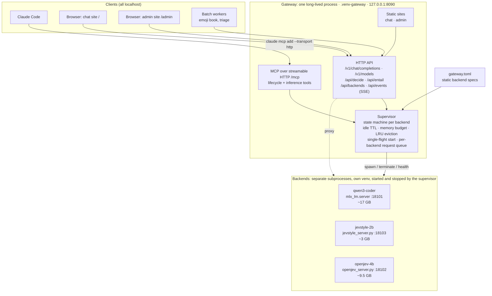
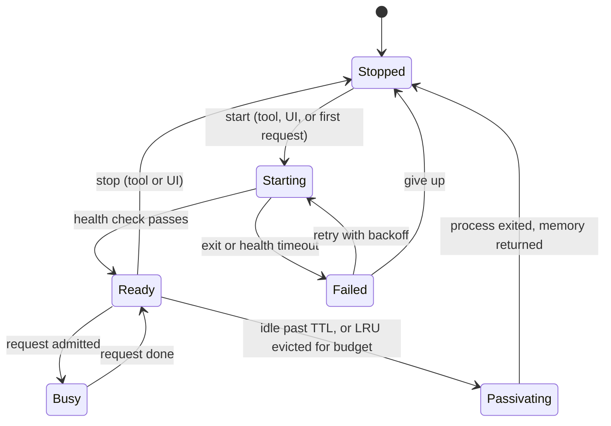
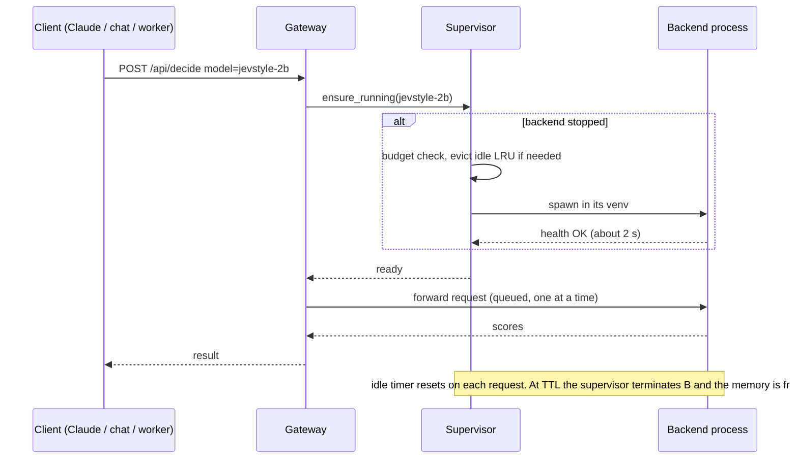

# Plan: a local model gateway with lifecycle, passivation, MCP and web UIs

Status: **design reviewed (see Decisions); phase 1 in progress.** Phases are tracked in the table below (DONE / TODO).

## Problem

Today every model is its own script, venv and sometimes port (see the architecture diagram in the [README](README.md)). That has three costs:

1. **Memory is the binding constraint, and nothing manages it.** Qwen3-Coder (~17 GB) + a second in-process copy of it for the emoji worker + OpenJev (~9 GB) + browsers pushed swap to 6 of 7 GB and the machine thrashed. Starting and stopping is manual.
2. **Every client knows about processes.** Claude Code talks to a third-party MCP bridge that only forwards to :8080; the chat page hard-codes :8080; the batch workers load their own model copies.
3. **Dependency pins conflict** (`mlx-lm` 0.31.3 for the decision model vs 0.32 for the LLM; `mcp<2` for the bridge), so the models cannot share a Python process.

## Goals

- One long-lived local daemon, the **gateway**, that supervises model **backends** as subprocesses: start, stop, health, status.
- **Passivation / depassivation**: a backend that has been idle for its TTL is stopped to give the memory back; the next request transparently starts it again (lazy start), and a global memory budget evicts the least-recently-used idle backend when a start would not fit.
- One front door for clients: an **MCP server** (lifecycle and inference tools), an **OpenAI-compatible API** for the LLM, and typed-decision / NLI endpoints.
- The gateway **publishes the chat website and a small admin website**.

Non-goals (for now): multi-user, remote access, auth beyond a local token, model downloading from the UI, a GPU scheduler cleverer than "one heavy request at a time per backend".

## Target architecture

## Key decisions

**D1. A daemon, not a stdio MCP server.** The websites and the idle timers must outlive any one Claude session, and several clients (Claude Code, browser, batch workers) need the same instance. Claude Code connects over MCP's HTTP transport. Alternative considered: keep a per-session stdio MCP server that talks to a separate daemon; rejected as two moving parts for no gain.

**D2. Passivation means the backend process exits.** MLX/Metal memory is only reliably returned to the OS on process exit, and separate processes also isolate the conflicting dependency pins. The cost is reload latency, which measured in this setup is small: Qwen3-Coder loads in about 2 s and Jev-Style in about 2 s with a warm page cache, OpenJev 4B in 6–13 s. Cold-cache load (weights not in the page cache) is untested and will be measured in phase 2; if it is bad, a longer default TTL for that backend is the lever. Alternative considered: in-process unload (`del model; gc`), rejected as unreliable on Metal.

**D3. The catalog is `gateway.toml`: adding a model is a few lines of config, with built-in adapters.** Built-in adapters know how to launch and health-check a kind of server, so a new model is a table, not code: `mlx_lm` (any `mlx-community` model id via `mlx_lm.server`), `jevstyle` (any Jev-Style MLX directory), `openjev_nli` (any OpenJev NLI checkpoint), and a generic `command` adapter for anything else that speaks HTTP on a port. Backends are described statically (never created at runtime from a request), behind a small adapter contract. Each backend declares `name`, `kind` (`llm` | `decision` | `nli`), `command` (venv python + script + args), `port`, `health` path, `est_mem_gb`, `ttl_s`, `pinned`. The MCP and HTTP surfaces can only start or stop declared backends; **no arbitrary command execution is reachable from MCP or the web**. The LLM backend is the unmodified `mlx_lm.server` (already OpenAI-compatible). The decision and NLI models get thin JSON servers (`jevstyle_server.py`: `decide` / `score_many`; `openjev_server.py`: `entail`) that wrap the code we already have, each in its own venv.

**D4. Passivation policy.**
- Per-backend idle TTL (proposed defaults: LLM 10 min, NLI 5 min, decision 15 min); a request counter prevents passivating a backend that is serving.
- A global memory budget (proposed 28 of 48 GB, leaving the rest for macOS, the JVM and sbt). Starting a backend that would exceed it first evicts idle backends in LRU order; if it still does not fit, the request waits briefly, then fails with 503 and a clear message instead of thrashing.
- `pinned` backends are never evicted by LRU or TTL.
- Optional pressure signal: if swap use grows while backends are resident, evict the LRU idle one early.
- Depassivation is **single-flight**: concurrent requests to a stopped backend share one start; they queue and then proceed.
- One request at a time per heavy backend (MLX is not safe to hammer concurrently, and we saw 3.5x slowdowns from GPU contention between two models). Light backends can opt into concurrency later.

**D5. Python on top of the `mcp` SDK already in use.** The gateway lives in a new `.venv-gateway` using `mcp<2` (FastMCP supports streamable HTTP and custom routes) with `httpx` for proxying; no JS build, the sites are static HTML plus the JSON/SSE API. Alternatives: FastAPI plus a separate MCP layer (two stacks), or Go/Rust (new toolchain for a localhost tool). To be verified in phase 1: FastMCP's custom routes and streaming proxying behave as expected on the pinned version.

**D6. Security posture.** Bind to 127.0.0.1 only. Mutating endpoints (start, stop, TTL, pin) require a random token generated at first run and stored 0600; the admin site reads it from a local file via a one-time URL fragment. Reject requests whose `Origin`/`Host` is not localhost to block DNS-rebinding and cross-site POSTs from other pages in the browser. Read-only status stays unauthenticated.

**D7. The third-party `mlx-mcp-server` is replaced, not extended.** It has no lifecycle concept, is unmaintained upstream (the linked repo 404s), and its `iterate` shell-gate is a risk surface. The gateway's MCP offers equivalent `chat`; whether to carry over `iterate`-style gated retries is an open question below.

## Passivation lifecycle

Lazy start, as seen by a client:

## Interfaces

**MCP tools** (over `/mcp`):

| Tool | Purpose |
|---|---|
| `backends_status` | state, resident GB, last used, idle seconds left, TTL, pinned, request count, plus system memory and swap |
| `start_backend(name)` / `stop_backend(name)` | explicit lifecycle (idempotent) |
| `set_backend_policy(name, ttl_s?, pinned?)` | adjust passivation per backend |
| `chat(model?, messages / message, ...)` | LLM chat; lazily starts the LLM |
| `decide(model?, state, questions)` | typed decisions (choice / score / yes-no) from the decision model |
| `entail(premise, hypotheses)` | NLI probabilities |

**HTTP:** `/v1/chat/completions` and `/v1/models` (OpenAI-compatible, streaming), `/api/decide`, `/api/entail`, `/api/backends` (GET status; POST start / stop / policy), `/api/events` (SSE of state changes and requests, used by the admin site), `/` (chat site), `/admin` (admin site).

## The two sites

- **Chat site** (`/`): today's `chat.html`, pointed at the gateway. Model picker lists LLM backends and shows when a model is cold ("starting… ~2 s"); everything else as now (streaming, system prompt, sampling, tok/s). Later: small playgrounds for `decide` and `entail`.
- **Admin site** (`/admin`): one table of backends with live state, resident memory, last-used and idle countdown, request count, TTL editor, pin toggle, Start / Stop buttons; a memory bar of resident backends against the budget; system memory and swap gauge (the swap needle is the thing we were missing); a scrolling event log fed by SSE (started, passivated: idle, evicted: budget, request, error).

## Phases

| # | Phase | Status |
|---|---|---|
| 0 | Restructure README with architecture and pipeline diagrams; move the findings log to `docs/FINDINGS.md` | **DONE** |
| 1 | `gateway.toml` schema; `jevstyle_server.py` and `openjev_server.py` thin backends; confirm FastMCP streamable-HTTP + custom routes + streaming proxy on `mcp<2`; measure cold-cache load times | **DONE** (cold-cache timing needs `sudo purge`, see findings) |
| 2 | Supervisor core: spawn / health / terminate, state machine, idle TTL, single-flight start, per-backend queue; CLI and unit tests with a fake backend | **DONE** |
| 3 | HTTP proxy: `/v1/chat/completions` (streaming), `/api/decide`, `/api/entail` with lazy start | TODO |
| 4 | MCP tools (table above); register in Claude Code with HTTP transport; retire `mlx-mcp-server` | TODO |
| 4b | `iterate` with restricted gates (schema, regex, contains, length) and an NLI faithfulness gate; no shell gate | TODO |
| 5 | Admin site and chat site served by the gateway; SSE events; token for mutating calls | TODO |
| 6 | Memory budget, LRU eviction, optional swap-pressure eviction | TODO |
| 7 | Migrate the emoji-book and triage workers to gateway clients (no in-process model copies) | TODO |
| 8 | Run as a login service (launchd or `brew services`), log rotation, repo tidy (move benches and logs out of the root) | TODO |

Each phase ends compiling and committed, and I would pause for review after phases 1, 4 and 5.

## Phase 1 findings

- **Catalog** (`gateway.toml`, `gateway/catalog.py`, 5 unit tests): four built-in adapters (`mlx_lm`, `jevstyle`, `openjev_nli`, `command`); adding a model is a TOML table. Strict validation (unknown keys, missing keys, types, loopback-only host, budget sanity); relative paths resolve against the catalog directory; ports are allocated in catalog order from `backend_port_base` (qwen3-coder 18101, openjev-4b 18102, jevstyle-2b 18103). `python -m gateway.catalog` prints the exact launch commands.
- **Backends** (`gateway/backends/`): stdlib-only JSON servers (no new deps in the pinned venvs) that listen only after the model is loaded, so `GET /health` = ready; requests serialized by a lock; client errors come back as 400 JSON. Measured warm start to ready: **Jev-Style 2.7 s, OpenJev 4B 11 s** (9 s load plus warm-up). Verified: correct decisions and NLI labels, clean error handling, clean stop.
- **MCP SDK** (`mcp` 1.30.0): one process can serve MCP over streamable HTTP (protocol 2025-11-25, client round trip verified with the SDK's own client), custom web routes, and an **incremental streaming proxy** (chunks arrived 0.4 s apart, not buffered). Claude Code has `claude mcp add --transport http`.
- **Gap found:** the SDK's Host-header (DNS-rebinding) check protects `/mcp` (returns 421 for `Host: evil.example`) but **not custom routes** (200). The gateway must apply its own Host/Origin check to every web and API route, as D6 states.
- **Metal memory is invisible to RSS** (OpenJev 4B showed 0.29 GB RSS with ~9 GB of weights on the GPU), so budget accounting must rely on declared `est_mem_gb`, plus system memory/swap readings, not per-process RSS.
- **Not measured:** cold-cache load time. Dropping the page cache needs `sudo purge`, which I do not run. If you want the number, run `sudo purge` and then start a backend from the catalog; otherwise phase 2's status page will record first-start timings as they happen.

## Phase 2 findings

`gateway/supervisor.py` (asyncio, ~350 lines), `gateway/cli.py`, `gateway/tests/` (21 tests including 15 supervisor tests against a controllable fake backend; stable over repeated runs).

- **What it does:** per-backend state machine (STOPPED, STARTING, READY, PASSIVATING, FAILED); `lease(name)` is the single entry point for clients (lazy start, admission to the per-backend queue, idle clock reset on exit); explicit `start` / `stop` (stop drains pending requests unless forced); `set_policy` (TTL and pin at runtime); `snapshot()` for the admin site; an event stream (`subscribe()` plus a 500-entry ring) for SSE.
- **Verified by test:** single-flight start under 8 concurrent callers; serialization at concurrency 1 and overlap at 2; idle passivation then transparent restart; never passivated while a request is leased or queued; pinned and ttl 0 respected; crash after ready then restart on the next lease; failed start reports the log tail and backs off (explicit start bypasses the backoff); start timeout kills the process; SIGTERM-ignoring backend escalates to SIGKILL; the whole process group (grandchildren too) dies; a restarted supervisor reaps orphans from pidfiles but leaves an unrelated process that reused the pid alone.
- **Verified live** with the real Jev-Style backend (`python -m gateway.cli demo jevstyle-2b --ttl 5`): lazy start 2.1 s, passivated after 5 s idle, depassivated in 1.8 s, clean shutdown, no orphans, no pidfiles left.
- **Bugs the tests caught:** the idle reaper only ran if a caller remembered to start it (now starts lazily on first use, so passivation can never be silently skipped); and the orphan check compared `argv[0]`, which breaks for Homebrew's python (it re-execs under another path), so it now matches the distinctive arguments, using `ps -ww` to avoid truncation.
- **Design notes:** all check-then-flip sections have no `await` in between (asyncio single-threaded), which is what makes the reaper-versus-lease race safe. Catalog gained `start_timeout_s`, `concurrency` and `[gateway].state_dir` (default `.gateway/`, git-ignored; logs in `logs/`, pidfiles in `pids/`).
- **Not yet:** memory budget and LRU eviction (phase 6). Until then two heavy backends can be resident at once, which is exactly what thrashed the machine, so the admin site (phase 5) must show it, and phase 6 should not slip far behind.

## Risks

- **Cold-start cost** may make aggressive TTLs painful for the 17 GB LLM; measured in phase 1, mitigated by per-backend TTL and pinning.
- **GPU contention** between simultaneously resident heavy models (observed 3.5x slowdown). The budget plus one-request-at-a-time reduces but does not eliminate it; the admin site should make "two heavy models resident" visible.
- **Metal memory accounting** is not exposed per process; `est_mem_gb` is declared in config and cross-checked against RSS and wired memory at runtime, so the budget is only as good as those numbers.
- **Orphaned backends.** Found the hard way in phase 1: killing a wrapper pid leaves the real model process running. The supervisor must `Popen` each backend in its own process group (`start_new_session=True`), terminate the group (SIGTERM, then SIGKILL after a grace period), and keep a pidfile so a restarted gateway can reap orphans from a crash.
- **SDK drift:** the `mcp` package is pinned below 2.x (FastMCP was renamed in 2.x); upgrading is a deliberate task.
- **Pinned decision-model runtime** (it refuses other `mlx-lm` versions): keeps the Jev-Style backend in its own venv forever, which the process-per-backend design already assumes.

## Decisions from review

1. **Model set:** Qwen3-Coder-30B (LLM), OpenJev 4B (NLI), Jev-Style 2B (decision) as the starting catalog; **adding a model must be trivial**, hence the adapter-based catalog in D3.
2. **Defaults:** memory budget 28 GB; TTLs 10 / 5 / 15 min (LLM / NLI / decision).
3. **Ports:** gateway on **:8090** (not 8080); backends on 18101 and up, allocated by the supervisor. Existing clients (chat page, `ask.sh`, the old MCP registration) are repointed at :8090.
4. **Auth:** a local token for mutating admin and MCP lifecycle calls is sufficient (D6).
5. **`iterate`:** carried over, as phase 4b after the core tools. My recommendation on worth: yes, in a restricted form. The old tool's value is the retry-until-a-gate-passes loop that keeps work on free local models; its risk was the shell gate. The gateway can offer gates that are strictly better and safe: JSON-schema / regex / contains / min-length, plus an **NLI faithfulness gate** (is the output entailed by the source text, using the OpenJev backend). No shell gate. Escalation to a bigger local backend or back to the caller stays.
6. **Workers:** the emoji-book and triage workers become gateway clients in phase 7.
7. **Service:** launchd (phase 8).

## Phases (continued)

Phase 4b: `iterate` with restricted and NLI gates. Add after phase 4.
