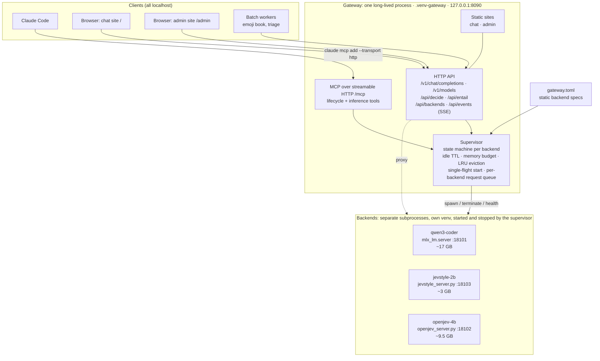
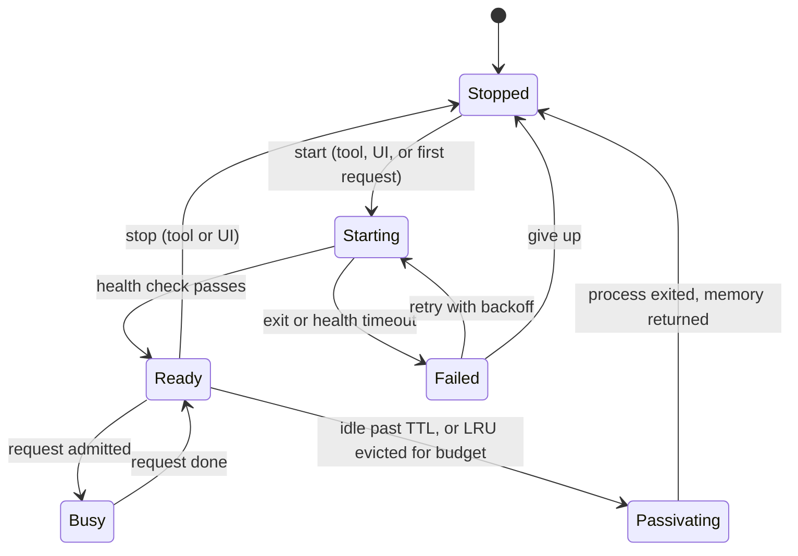
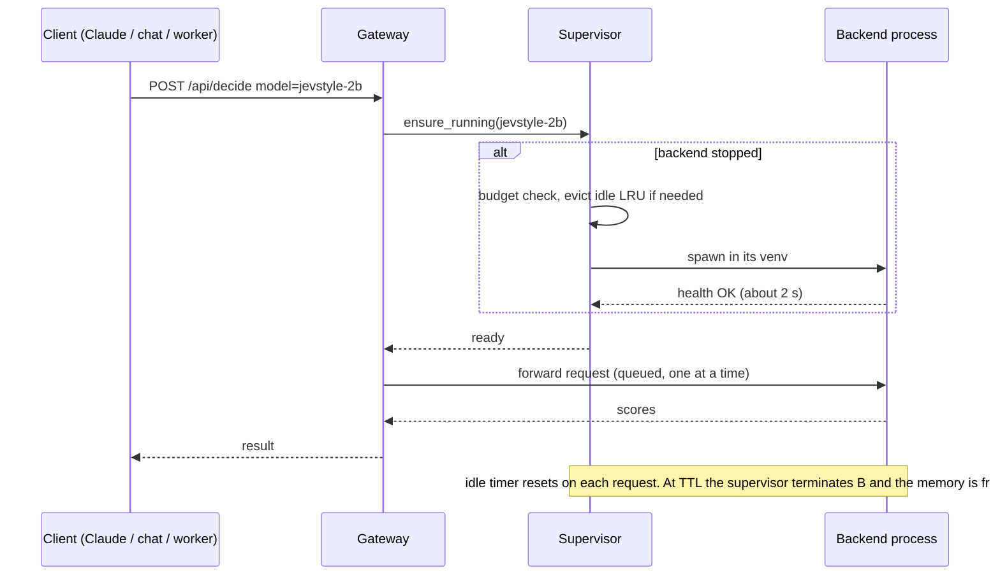

# Plan: a local model gateway with lifecycle, passivation, MCP and web UIs

Status: **phases 1–12 done** (11 and 12, and the changes under [Landed without a plan](#landed-without-a-plan), are written up after the fact). Phases are tracked in the table below (DONE / TODO); ideas not yet started are under [Future work](#future-work).

## Problem

Today every model is its own script, venv and sometimes port (see the architecture diagram in the [README](README.md)). That has three costs:

1. **Memory is the binding constraint, and nothing manages it.** Qwen3-Coder (~17 GB) + a second in-process copy of it for the emoji worker + OpenJev (~9 GB) + browsers pushed swap to 6 of 7 GB and the machine thrashed. Starting and stopping is manual.
2. **Every client knows about processes.** Claude Code talks to a third-party MCP bridge that only forwards to :8080; the chat page hard-codes :8080; the batch workers load their own model copies.
3. **Dependency pins conflict** (`mlx-lm` 0.31.3 for the decision model vs 0.32 for the LLM; `mcp<2` for the bridge), so the models cannot share a Python process.

## Goals

- One long-lived local daemon, the **gateway**, that supervises model **backends** as subprocesses: start, stop, health, status.
- **Passivation / depassivation**: a backend that has been idle for its TTL is stopped to give the memory back; the next request transparently starts it again (lazy start), and a global memory budget evicts the least-recently-used idle backend when a start would not fit.
- One front door for clients: an **MCP server** (lifecycle and inference tools), an **OpenAI-compatible API** for the LLM, and typed-decision / NLI endpoints.
- The gateway **publishes the chat website and a small admin website**.

Non-goals (for now): multi-user, remote access, auth beyond a local token, model downloading from the UI, a GPU scheduler cleverer than "one heavy request at a time per backend".

## Target architecture

## Key decisions

**D1. A daemon, not a stdio MCP server.** The websites and the idle timers must outlive any one Claude session, and several clients (Claude Code, browser, batch workers) need the same instance. Claude Code connects over MCP's HTTP transport. Alternative considered: keep a per-session stdio MCP server that talks to a separate daemon; rejected as two moving parts for no gain.

**D2. Passivation means the backend process exits.** MLX/Metal memory is only reliably returned to the OS on process exit, and separate processes also isolate the conflicting dependency pins. The cost is reload latency, which measured in this setup is small: Qwen3-Coder loads in about 2 s and Jev-Style in about 2 s with a warm page cache, OpenJev 4B in 6–13 s. Cold-cache load (weights not in the page cache) is untested and will be measured in phase 2; if it is bad, a longer default TTL for that backend is the lever. Alternative considered: in-process unload (`del model; gc`), rejected as unreliable on Metal.

**D3. The catalog is `gateway.toml`: adding a model is a few lines of config, with built-in adapters.** Built-in adapters know how to launch and health-check a kind of server, so a new model is a table, not code: `mlx_lm` (any `mlx-community` model id via `mlx_lm.server`), `jevstyle` (any Jev-Style MLX directory), `openjev_nli` (any OpenJev NLI checkpoint), and a generic `command` adapter for anything else that speaks HTTP on a port. Backends are described statically (never created at runtime from a request), behind a small adapter contract. Each backend declares `name`, `kind` (`llm` | `decision` | `nli`), `command` (venv python + script + args), `port`, `health` path, `est_mem_gb`, `ttl_s`, `pinned`. The MCP and HTTP surfaces can only start or stop declared backends; **no arbitrary command execution is reachable from MCP or the web**. The LLM backend is the unmodified `mlx_lm.server` (already OpenAI-compatible). The decision and NLI models get thin JSON servers (`jevstyle_server.py`: `decide` / `score_many`; `openjev_server.py`: `entail`) that wrap the code we already have, each in its own venv.

**D4. Passivation policy.**
- Per-backend idle TTL (proposed defaults: LLM 10 min, NLI 5 min, decision 15 min); a request counter prevents passivating a backend that is serving.
- A global memory budget (proposed 28 of 48 GB, leaving the rest for macOS, the JVM and sbt). Starting a backend that would exceed it first evicts idle backends in LRU order; if it still does not fit, the request waits briefly, then fails with 503 and a clear message instead of thrashing.
- `pinned` backends are never evicted by LRU or TTL.
- Optional pressure signal: if swap use grows while backends are resident, evict the LRU idle one early.
- Depassivation is **single-flight**: concurrent requests to a stopped backend share one start; they queue and then proceed.
- One request at a time per heavy backend (MLX is not safe to hammer concurrently, and we saw 3.5x slowdowns from GPU contention between two models). Light backends can opt into concurrency later.

**D5. Python on top of the `mcp` SDK already in use.** The gateway lives in a new `.venv-gateway` using `mcp<2` (FastMCP supports streamable HTTP and custom routes) with `httpx` for proxying; no JS build, the sites are static HTML plus the JSON/SSE API. Alternatives: FastAPI plus a separate MCP layer (two stacks), or Go/Rust (new toolchain for a localhost tool). To be verified in phase 1: FastMCP's custom routes and streaming proxying behave as expected on the pinned version.

**D6. Security posture.** Bind to 127.0.0.1 only. Mutating endpoints (start, stop, TTL, pin) require a random token generated at first run and stored 0600; the admin site reads it from a local file via a one-time URL fragment. Reject requests whose `Origin`/`Host` is not localhost to block DNS-rebinding and cross-site POSTs from other pages in the browser. Read-only status stays unauthenticated.

**D7. The third-party `mlx-mcp-server` is replaced, not extended.** It has no lifecycle concept, is unmaintained upstream (the linked repo 404s), and its `iterate` shell-gate is a risk surface. The gateway's MCP offers equivalent `chat`; whether to carry over `iterate`-style gated retries is an open question below.

## Passivation lifecycle

Lazy start, as seen by a client:

## Interfaces

**MCP tools** (over `/mcp`):

| Tool | Purpose |
|---|---|
| `backends_status` | state, resident GB, last used, idle seconds left, TTL, pinned, request count, plus system memory and swap |
| `start_backend(name)` / `stop_backend(name)` | explicit lifecycle (idempotent) |
| `set_backend_policy(name, ttl_s?, pinned?)` | adjust passivation per backend |
| `chat(model?, messages / message, ...)` | LLM chat; lazily starts the LLM |
| `decide(model?, state, questions)` | typed decisions (choice / score / yes-no) from the decision model |
| `entail(premise, hypotheses)` | NLI probabilities |

**HTTP:** `/v1/chat/completions` and `/v1/models` (OpenAI-compatible, streaming), `/api/decide`, `/api/entail`, `/api/backends` (GET status; POST start / stop / policy), `/api/events` (SSE of state changes and requests, used by the admin site), `/` (chat site), `/admin` (admin site).

## The two sites

- **Chat site** (`/`): today's `chat.html`, pointed at the gateway. Model picker lists LLM backends and shows when a model is cold ("starting… ~2 s"); everything else as now (streaming, system prompt, sampling, tok/s). Later: small playgrounds for `decide` and `entail`.
- **Admin site** (`/admin`): one table of backends with live state, resident memory, last-used and idle countdown, request count, TTL editor, pin toggle, Start / Stop buttons; a memory bar of resident backends against the budget; system memory and swap gauge (the swap needle is the thing we were missing); a scrolling event log fed by SSE (started, passivated: idle, evicted: budget, request, error).

## Phases

| # | Phase | Status |
|---|---|---|
| 0 | Restructure README with architecture and pipeline diagrams; move the findings log to `docs/FINDINGS.md` | **DONE** |
| 1 | `gateway.toml` schema; `jevstyle_server.py` and `openjev_server.py` thin backends; confirm FastMCP streamable-HTTP + custom routes + streaming proxy on `mcp<2`; measure cold-cache load times | **DONE** (cold-cache timing needs `sudo purge`, see findings) |
| 2 | Supervisor core: spawn / health / terminate, state machine, idle TTL, single-flight start, per-backend queue; CLI and unit tests with a fake backend | **DONE** |
| 3 | HTTP proxy: `/v1/chat/completions` (streaming), `/api/decide`, `/api/entail` with lazy start | **DONE** |
| 4 | MCP tools (table above); register in Claude Code with HTTP transport; retire `mlx-mcp-server` | **DONE** (review pause) |
| 4b | `iterate` with restricted gates (schema, regex, contains, length) and an NLI faithfulness gate; no shell gate | **DONE** |
| 5 | Admin site and chat site served by the gateway; SSE events; token for mutating calls | **DONE** |
| 6 | Memory budget, LRU eviction, optional swap-pressure eviction | **DONE** (built before phases 4-5, at your request) |
| 7 | Migrate the emoji-book and triage workers to gateway clients (no in-process model copies) | **DONE** (see [Phase 7 findings](#phase-7-findings)) |
| 8 | Run as a login service (launchd or `brew services`), log rotation, repo tidy (move benches and logs out of the root) | **DONE** (service and log rotation; the repo tidy after phase 7: `pipelines/`, `experiments/`) |
| 9 | Speech: a `kokoro` TTS backend behind `/v1/audio/speech`, a `speak` MCP tool, then Qwen3-TTS for cloned or designed voices (see [Speech](#speech-phase-9)) | **DONE** |
| 10 | Vision: Gemma 4 / Qwen3.6 vision via mlx-vlm, `look` MCP tool, image parts on `/v1/chat/completions`, `/vision` page, home page (see [Vision](#vision-phase-10)) | **DONE** |
| 11 | Translate: `/api/translate`, `translate` MCP tool, macOS Vision OCR for screenshots, a client for a macOS Shortcut (see [Translate](#translate-phase-11)) | **DONE** |
| 12 | Search: embedder + reranker backend, `/search`, `search` MCP tool, a sync/embed indexer over Scala sources and issues (see [Search](#search-phase-12), written post hoc) | **DONE** |

Each phase ends compiling and committed, and I would pause for review after phases 1, 4 and 5.

## Phase 1 findings

- **Catalog** (`gateway.toml`, `gateway/catalog.py`, 5 unit tests): four built-in adapters (`mlx_lm`, `jevstyle`, `openjev_nli`, `command`); adding a model is a TOML table. Strict validation (unknown keys, missing keys, types, loopback-only host, budget sanity); relative paths resolve against the catalog directory; ports are allocated in catalog order from `backend_port_base` (qwen3-coder 18101, openjev-4b 18102, jevstyle-2b 18103). `python -m gateway.catalog` prints the exact launch commands.
- **Backends** (`gateway/backends/`): stdlib-only JSON servers (no new deps in the pinned venvs) that listen only after the model is loaded, so `GET /health` = ready; requests serialized by a lock; client errors come back as 400 JSON. Measured warm start to ready: **Jev-Style 2.7 s, OpenJev 4B 11 s** (9 s load plus warm-up). Verified: correct decisions and NLI labels, clean error handling, clean stop.
- **MCP SDK** (`mcp` 1.30.0): one process can serve MCP over streamable HTTP (protocol 2025-11-25, client round trip verified with the SDK's own client), custom web routes, and an **incremental streaming proxy** (chunks arrived 0.4 s apart, not buffered). Claude Code has `claude mcp add --transport http`.
- **Gap found:** the SDK's Host-header (DNS-rebinding) check protects `/mcp` (returns 421 for `Host: evil.example`) but **not custom routes** (200). The gateway must apply its own Host/Origin check to every web and API route, as D6 states.
- **Metal memory is invisible to RSS** (OpenJev 4B showed 0.29 GB RSS with ~9 GB of weights on the GPU), so budget accounting must rely on declared `est_mem_gb`, plus system memory/swap readings, not per-process RSS.
- **Not measured:** cold-cache load time. Dropping the page cache needs `sudo purge`, which I do not run. If you want the number, run `sudo purge` and then start a backend from the catalog; otherwise phase 2's status page will record first-start timings as they happen.

## Phase 2 findings

`gateway/supervisor.py` (asyncio, ~350 lines), `gateway/cli.py`, `gateway/tests/` (21 tests including 15 supervisor tests against a controllable fake backend; stable over repeated runs).

- **What it does:** per-backend state machine (STOPPED, STARTING, READY, PASSIVATING, FAILED); `lease(name)` is the single entry point for clients (lazy start, admission to the per-backend queue, idle clock reset on exit); explicit `start` / `stop` (stop drains pending requests unless forced); `set_policy` (TTL and pin at runtime); `snapshot()` for the admin site; an event stream (`subscribe()` plus a 500-entry ring) for SSE.
- **Verified by test:** single-flight start under 8 concurrent callers; serialization at concurrency 1 and overlap at 2; idle passivation then transparent restart; never passivated while a request is leased or queued; pinned and ttl 0 respected; crash after ready then restart on the next lease; failed start reports the log tail and backs off (explicit start bypasses the backoff); start timeout kills the process; SIGTERM-ignoring backend escalates to SIGKILL; the whole process group (grandchildren too) dies; a restarted supervisor reaps orphans from pidfiles but leaves an unrelated process that reused the pid alone.
- **Verified live** with the real Jev-Style backend (`python -m gateway.cli demo jevstyle-2b --ttl 5`): lazy start 2.1 s, passivated after 5 s idle, depassivated in 1.8 s, clean shutdown, no orphans, no pidfiles left.
- **Bugs the tests caught:** the idle reaper only ran if a caller remembered to start it (now starts lazily on first use, so passivation can never be silently skipped); and the orphan check compared `argv[0]`, which breaks for Homebrew's python (it re-execs under another path), so it now matches the distinctive arguments, using `ps -ww` to avoid truncation.
- **Design notes:** all check-then-flip sections have no `await` in between (asyncio single-threaded), which is what makes the reaper-versus-lease race safe. Catalog gained `start_timeout_s`, `concurrency` and `[gateway].state_dir` (default `.gateway/`, git-ignored; logs in `logs/`, pidfiles in `pids/`).
- **Not yet:** memory budget and LRU eviction (phase 6). Until then two heavy backends can be resident at once, which is exactly what thrashed the machine, so the admin site (phase 5) must show it, and phase 6 should not slip far behind.

## Catalog evolution (from a model-selection thread; items 1, 2, 3 and 5 DONE, 4 and 6 not selected)

Input: a r/LocalLLM thread on what to run on 48 GB Apple-silicon Macs (a user's own report, treated as claims; the repo ids, sizes and architecture support below were checked). The main model advice is to prefer MoE models: Qwen3.6-35B-A3B (20.4 GB at 4-bit, `qwen3_5_moe`) and Gemma-4-26B-A4B (15.6 GB QAT 4-bit, `gemma4`), both supported by mlx-lm 0.32; dense 27B models are reported at 8-12 tok/s. DeepSeek-V4-Flash is 151.5 GB, so it is not a candidate here. Commented entries for the first two are in `gateway.toml`. Our measured Qwen3-Coder-30B-A3B (103 tok/s, 17.2 GB) is the same MoE class, so the right next step is a head-to-head on our sub-agent tasks, not a switch.

What the thread implies for the catalog schema, ranked by value:

1. **DONE: Profiles with request defaults (thinking toggle).** Reasoning models loop ("wait... wait...") and people want thinking on for hard tasks and off for chat. `mlx_lm.server` accepts per-request `chat_template_kwargs`, so a catalog `[profiles.<name>]` (a named virtual model on an existing backend, e.g. `qwen3.6-fast` = backend `qwen3-6-35b-a3b` + `chat_template_kwargs.enable_thinking = false`, temperature, max_tokens) lets clients pick a mode by model name with no second process. Merge rule: profile defaults fill only what the request omits.
2. **DONE: Memory is weights plus KV cache.** The thread reports ~30 GB for a 35B MoE at 5-bit with a 264K context (20 GB weights). `est_mem_gb` must include KV at the configured context, and the adapter should expose KV controls. Document this in the catalog and let phase 6's budget use it.
3. **DONE: Adapter argument passthrough** (`args = [...]`, static in the catalog, never from requests): `--kv-bits`, `--max-tokens`, `--temp`, `--chat-template-args`, `--draft-model` / `--num-draft-tokens` (speculative decoding, the thread's "MTP / dflash" theme), `--decode-concurrency`, `--prompt-cache-bytes`. All exist on the installed `mlx_lm.server`.
4. **Not selected: `external` adapter**: attach to an already-running OpenAI-compatible server (oMLX, LM Studio, Ollama, a remote box) by URL. Unmanaged: no start/stop/passivation, but it appears in the admin site and behind the same API and token.
5. **DONE: Discovery**: list MLX models already on disk (HF cache, LM Studio's folder, which the thread notes oMLX and LM Studio share) with size and architecture, and generate the catalog snippet. Admin-site feature, read-only; never launches anything.
6. **Not selected (no schema needed): roles by alias convention** (`fast`, `coder`, `default`) instead of new schema: aliases already exist and the thread's planner/implementer split maps onto them.

Not catalog concerns: agent-harness token overhead, and model quality ranking (benchmark ourselves).

Implementation notes (2026-10-04): `gateway/profiles.py`, `gateway/kv.py`, `gateway/discovery.py`, hooks in `catalog.py`, `core.py`, `app.py`, `mcp_server.py`, `cli.py`; 40 new tests.
- **A live check found a thing the thread did not say:** under mlx-lm both Qwen3.6 *and* Gemma 4 think by default (a plain Gemma request returned only reasoning and no answer). The catalog now starts both with thinking off via `args`, and `qwen3-6-think` / `gemma-4-think` profiles turn it on with a token cap. Verified live: 39 and 35 tokens for a plain request, reasoning plus answer for the profiles, and a client `chat_template_kwargs` still overrides.
- **Profiles are fill-only** (client values win, including 0 and false; `null` counts as absent; `chat_template_kwargs` merges key by key; a system prompt is added only if the request has none). Allowed default keys are whitelisted per backend kind.
- **MCP limitation:** the `chat` and `iterate` tools always send their own `max_tokens` and `temperature`, so those stay authoritative over a profile's values; profile defaults fill everything else (thinking flags, system prompt). Making those tool parameters optional would change the tool schema, so it was left.
- **Discovery** sizes from `stat` on the safetensors files (`du` is unreliable on the HF cache), MLX format from the safetensors header, architecture support from the installed mlx-lm (asked in a subprocess with the catalog's own python). The KV estimator reproduces hand calculations (96 / 20 / 20 KiB per token for the three LLMs; 3.22 / 0.67 / 0.88 GB at 32K) and handles full, sliding-window and linear-attention layers plus MLA latents.
- **Memory parts** gave slightly different totals than the earlier hand-set numbers (Qwen3.6 22.1 vs 22.5 GB, Gemma 17.6 vs 17.0 GB), which is the point: the figures are now derived, not guessed.

## Phase 3 findings

`gateway/app.py` (Starlette), `gateway/__main__.py` (`python -m gateway`), `gateway/tests/test_app.py` and `test_main.py`; 34 tests in total, stable over repeated runs.

- **Endpoints** (all on :8090): `POST /v1/chat/completions` (OpenAI-compatible, streaming and not), `GET /v1/models`, `POST /api/decide` (routes to the backend's `/decide`, or `/score_many` when the body has `questions`), `POST /api/entail`, read-only `GET /api/backends`, `GET /healthz`. `model` resolves by backend name or alias (an `mlx_lm` model id is an implicit alias, so existing clients that send the Hugging Face id keep working), defaults to `default_llm`, and is rewritten to the backend's own id (`mlx_lm.server` may otherwise try to load a different model).
- **Streaming:** chunks are proxied incrementally (verified arrival spacing); the lease is held for the whole stream so a backend cannot be passivated mid-response, and it is released when the client disconnects. A cold start is reported in `X-Gateway-Cold-Start-Secs`; `X-Gateway-Backend` names the backend.
- **Errors** use the OpenAI error shape: 404 `model_not_found`, 400 `wrong_model_kind` / `invalid_json`, 503 `backend_start_failed` (with the backend's log tail) then `backend_unavailable` with `Retry-After` during backoff, 502 `backend_error`; a backend's own 4xx passes through unchanged.
- **Host/Origin policy** is a pure-ASGI middleware over every route: wrong Host or port is 421, a non-loopback Origin is 403 (rejected before any backend is started), loopback origins get CORS and preflights are answered. Verified live.
- **Live run with the real models** (`python -m gateway`): Qwen3-Coder cold start 6.7 s, first streamed token 9.3 s after the request, warm requests carry no cold header; Jev-Style cold start 3.5 s; OpenJev 15.4 s (it was 11 s on an idle machine, see below).
- **Bug found only by the live test:** after SIGTERM the gateway exited but left every backend running. Cause: uvicorn >= 0.29 re-raises a captured signal as soon as `serve()` returns, killing the process before our cleanup ran. The gateway now owns signal handling (first signal graceful, second forces) so the cleanup always runs. `test_main.py` runs the real `python -m gateway` as a subprocess and asserts it exits 0 and that the backend, its child and the pidfiles are gone; I confirmed the test fails (exit -15) without the fix. The supervisor's orphan reaper was also validated for real: it cleaned up the three backends the buggy shutdown had left.
- **Evidence for phase 6:** with all three backends resident (30 GB of the 28 GB budget, which is not enforced yet) free memory fell to 41% and swap reached 12.5 of 13.3 GB, and the OpenJev cold start slowed from 11 s to 15 s. The gateway makes it easy to start everything, so enforcing the budget should come before the MCP and web phases.

## Phase 6 findings

`gateway/memory.py` (system probe), admission control and the pressure monitor in `gateway/supervisor.py`, new `[gateway]` settings in the catalog, HTTP mapping in `gateway/app.py`; 54 tests in total (14 new ones in `test_memory_budget.py`, plus catalog, memory-probe and HTTP cases), stable over repeated runs.

- **Admission control.** Before a backend is spawned it must fit the budget (sum of `est_mem_gb` of everything that holds memory). If it does not, idle backends are evicted least-recently-used first. Rules, all tested: busy backends (a request pending or in flight) and pinned backends are never evicted; a PASSIVATING backend still counts against the budget until its process has actually exited (so a SIGTERM-ignoring backend cannot cause an overcommit); the check-and-reserve step is serialized, so two concurrent starts cannot claim the same free memory; if nothing can be evicted the start waits up to `room_timeout_s`, then fails with `InsufficientMemory`, which is deliberately not a backend fault (no FAILED state, no retry backoff) and surfaces as HTTP 503 `insufficient_memory` with `Retry-After` and a message naming who holds the memory (`x (pinned)`, `a (busy)`).
- **Pressure monitor.** Every `pressure_interval_s` it reads `kern.memorystatus_level` and `vm.swapusage` (about 3 ms). If free memory is below `min_free_pct`, or swap grew by `swap_growth_gb` within `pressure_window_s`, it evicts the LRU idle backend, with a cooldown so memory can settle; busy and pinned backends are never touched. It can be turned off.
- **Catalog validation:** the pinned backends together must fit the budget.
- **Observability.** `/api/backends` reports `memory_budget_gb`, `resident_est_gb`, `free_est_gb` and the live `system` reading (free percentage, swap); each backend shows `holds_memory`; events include `waiting_for_memory`, `rejected`, `pressure` and eviction reasons.
- **Live run with the real models, same sequence that thrashed the machine before.** Qwen (17.5) and OpenJev (9.5) are 27 of 28 GB by estimate, so the budget alone allowed both, but while OpenJev loaded swap grew 3.1 GB in 10 s and the monitor evicted the idle Qwen (`pressure: swap grew 3.1 GB in 10s`). Then Jev-Style started (12.5 of 28 GB). Asking for Qwen again (30 > 28) evicted the least recently used backend, OpenJev, via the budget path, and Qwen was back in 2.3 s. Net effect on the machine: swap rose about 3 GB over the whole sequence and free memory recovered (43%, 61%, 74%), versus the unprotected run where swap hit 12.5 of 13.3 GB and free memory fell to 41%.
- **What this says about the numbers.** The budget alone is optimistic: 27 GB of estimates were enough to push swap up on this machine with a browser, IntelliJ and about 6 GB of leftover swap in play. The pressure monitor is what made it safe. If the pressure monitor fires often, lower `memory_budget_gb` (24 would keep Qwen and OpenJev from being resident together).

## Phase 4 findings

`gateway/mcp_server.py`, `gateway/core.py` (error mapping, model resolution and lease-and-POST shared by the HTTP routes and the tools), `gateway/auth.py`, `register_mcp.sh`, `gateway/live_check.py`; 65 tests in total (11 new MCP and auth tests that use the SDK's own client against a real gateway).

- **Tools:** `backends_status`, `chat`, `decide`, `entail`, `start_backend`, `stop_backend`, `set_backend_policy`. Outputs are compact for an agent's context: `decide` returns the answer plus the `top_k` most likely options (default 5, 0 = all; a 346-emoji question would otherwise return 346 numbers), `entail` returns a label plus the three probabilities per hypothesis, `chat` returns the text with usage and timing. Errors name their kind (`insufficient_memory`, `model_not_found`, `invalid_arguments`, `unauthorized`) so the calling agent can react. The server also ships `instructions` telling the agent when to use local models and that they can be wrong.
- **Token (D6):** state-changing tools check the `Authorization: Bearer` header of the request itself (read from the MCP request context), so a prompt-injected model cannot start, stop or re-pin models without it; the token is generated on first run in `.gateway/token` with mode 0600 (created exclusively, never briefly world-readable) and compared in constant time. Status and inference stay open on localhost. `python -m gateway token` / `url` print what registration needs.
- **Transport:** FastMCP's streamable-HTTP app is mounted behind our own routes in one Starlette app, with its session manager running in our lifespan. I used `stateless_http` with JSON responses, so a gateway restart does not invalidate client sessions (no reconnect dance). The Host/Origin middleware covers `/mcp` as well (tested), on top of the SDK's own Host check.
- **Registered with Claude Code** over HTTP (local scope at first; user scope since phase 8, so worktrees and other projects get it) (`claude mcp list` shows it connected). **The old `mlx-mcp-server` is retired:** unregistered, uninstalled from `.venv`, and its obsolete stdio smoke test removed; its vetting notes stay in `docs/FINDINGS.md`.
- **Live run with the real models through MCP** (`gateway.live_check`, all checks passed): `chat` 5.4 s including a cold Qwen start, `decide` 3.4 s cold then 0.1 s for a multi-question call on the warm model, `entail` 10.6 s cold (OpenJev), lifecycle tools refused without the token and working with it. The status after the run showed Qwen already stopped: starting OpenJev (27 of 28 GB by estimate) made the memory policy evict the idle Qwen, as designed.
- **Operational note:** Claude Code only connects while the gateway is running. Until the launchd service (phase 8), start it with `.venv/bin/python -m gateway &`. A running Claude Code session keeps the tools it loaded at start, so restart it to switch from the old `mcp__mlx__*` tools to the new ones.
- **Rough edge:** tool results are pretty-printed JSON text (FastMCP's default for plain dict returns), which costs more tokens than needed; `backends_status` is about 600 tokens. Returning compact JSON is a small follow-up.

## Phase 5 findings

`gateway/web/chat.html`, `gateway/web/admin.html`, lifecycle API, SSE and page routes in `gateway/app.py`, shared lifecycle operations in `gateway/core.py`, single-instance lock and shutdown handling in `gateway/__main__.py`; 78 tests in total (11 web tests, 2 more shutdown tests). The standalone `chat.html` / `chat.sh` are removed; `ask.sh` now targets the gateway by default.

- **HTTP lifecycle API**, same bearer token as the MCP tools: `POST /api/backends/{name}/start|stop|policy`. Start, stop and policy now share one implementation (`core.op_*`) between HTTP and MCP, so validation (TTL range, pin-versus-budget) is identical. A cross-site `Origin` is rejected before the token is even checked, and the page's own same-origin calls pass.
- **SSE** `/api/events`: a status snapshot every second (so idle countdowns tick) plus every lifecycle event, with the last 60 replayed (flagged) on connect. The subscription is released on disconnect (tested), and streams end themselves when shutdown begins.
- **Pages** are single self-contained files with no external loads (a test greps for it), served with a strict Content-Security-Policy (`default-src 'none'`, `connect-src 'self'`, no framing), `nosniff`, `no-referrer` and `no-store`; the Host policy applies to them too.
- **Chat site** (`/`): same-origin, model picker with live state ("stopped · starts on first message"), and an elapsed-time message while a cold model loads (response headers only arrive once it is up), then the stats line adds `cold start Ns`; errors show the gateway's message and `Retry-After`.
- **Admin site** (`/admin`): stacked memory-budget bar (per-backend colour plus legend, names inside segments only when wide enough), macOS free-memory and swap gauges with the eviction threshold marked, a backend table updated in place (a 1 Hz refresh does not disturb an open TTL box) with start/stop, TTL editor, pin and idle countdown, and an event log. The token arrives once in the URL fragment (`python -m gateway admin`), is kept in sessionStorage for that tab and stripped from the URL; without it the page is read-only and says how to authenticate.
- **Verified end to end in a browser against the real models:** a first chat message showed "Starting qwen3-coder… 2s", then a streamed Scala answer (99 tokens at 87 tok/s, cold start 2.36 s); in the admin site, Start on OpenJev reserved its 9.5 GB in the budget bar while "starting", the **pressure monitor evicted the idle Qwen** (swap grew 3.4 GB in 25 s) while it loaded, then Jev-Style started in the freed room; setting its TTL to 30 s and pinning OpenJev showed in the log, and Jev-Style then passivated on schedule ("idle for 30s") with the bar dropping to the pinned model only.
- **Three problems found by running it for real, now fixed with regression tests:** (1) a double TTL commit (Enter then blur) logged two policy events; (2) **graceful shutdown hung** whenever a long-lived connection was open (an admin tab's SSE stream): uvicorn waits forever for connections to close, and the stuck old gateway then overlapped with a restarted one. Fix: SSE streams end themselves when shutdown begins, plus a 5 s `timeout_graceful_shutdown` backstop for anything else (MCP streams); (3) that overlap exposed that a **second gateway on the same state directory would reap the first one's backends as orphans**. Fix: a single-instance `flock` on `.gateway/gateway.lock` (released by the OS on any exit, so it can never go stale); a second gateway now exits with code 2 naming the holder.
- **Token hygiene:** the admin page needed the token in a tool call during testing, so I rotated it afterwards (delete `.gateway/token`, restart, re-run `./register_mcp.sh`) and confirmed the old one returns 401.

## Risks

- **Cold-start cost** may make aggressive TTLs painful for the 17 GB LLM; measured in phase 1, mitigated by per-backend TTL and pinning.
- **GPU contention** between simultaneously resident heavy models (observed 3.5x slowdown). The budget plus one-request-at-a-time reduces but does not eliminate it; the admin site should make "two heavy models resident" visible.
- **Metal memory accounting** is not exposed per process; `est_mem_gb` is declared in config and cross-checked against RSS and wired memory at runtime, so the budget is only as good as those numbers.
- **Orphaned backends.** Found the hard way in phase 1: killing a wrapper pid leaves the real model process running. The supervisor must `Popen` each backend in its own process group (`start_new_session=True`), terminate the group (SIGTERM, then SIGKILL after a grace period), and keep a pidfile so a restarted gateway can reap orphans from a crash.
- **SDK drift:** the `mcp` package is pinned below 2.x (FastMCP was renamed in 2.x); upgrading is a deliberate task.
- **Pinned decision-model runtime** (it refuses other `mlx-lm` versions): keeps the Jev-Style backend in its own venv forever, which the process-per-backend design already assumes.

## Decisions from review

1. **Model set:** Qwen3-Coder-30B (LLM), OpenJev 4B (NLI), Jev-Style 2B (decision) as the starting catalog; **adding a model must be trivial**, hence the adapter-based catalog in D3.
2. **Defaults:** memory budget 28 GB; TTLs 10 / 5 / 15 min (LLM / NLI / decision).
3. **Ports:** gateway on **:8090** (not 8080); backends on 18101 and up, allocated by the supervisor. Existing clients (chat page, `ask.sh`, the old MCP registration) are repointed at :8090.
4. **Auth:** a local token for mutating admin and MCP lifecycle calls is sufficient (D6).
5. **`iterate`:** carried over, as phase 4b after the core tools. My recommendation on worth: yes, in a restricted form. The old tool's value is the retry-until-a-gate-passes loop that keeps work on free local models; its risk was the shell gate. The gateway can offer gates that are strictly better and safe: JSON-schema / regex / contains / min-length, plus an **NLI faithfulness gate** (is the output entailed by the source text, using the OpenJev backend). No shell gate. Escalation to a bigger local backend or back to the caller stays.
6. **Workers:** the emoji-book and triage workers become gateway clients in phase 7.
7. **Service:** launchd (phase 8).

## Phases (continued)

Phase 4b: `iterate` with restricted and NLI gates (done, see findings below).

## Phase 4b findings

`gateway/gates.py` (gate specs, validation, checks), `gateway/iterate.py` (the retry loop, pure: chat and entail are injected), the `iterate` MCP tool in `gateway/mcp_server.py`; 90 tests in total (12 new, including the tool end to end against fake backends).

- **Gates:** `json` (parses bare, fenced or embedded JSON; optional JSON Schema via `jsonschema`), `regex` (`match` or `absent`; `^`/`$` anchor the whole answer unless `multiline`: a live run showed per-line anchors letting a looping 2,390-char answer pass), `contains` (`all` / `any` / `none`), `length`, and `nli` (every sentence of the answer, minus code blocks, must be entailed by a caller-supplied `source` and not contradicted; thresholds `min_entailment` 0.5, `max_contradiction` 0.5). Specs are validated before any model runs (unknown keys and bad schemas are `invalid_arguments`). **No shell or code gate**: a gate can only read text.
- **Loop:** cheap gates run first and the NLI gate (which may start OpenJev) only after they pass. On failure the model sees its last answer plus the failing messages (history does not grow beyond that), up to `max_attempts` (default 3, cap 6). `escalate_to` names another local LLM for the final attempt. Exhausting the attempts is a result, not an error: `passed: false`, the last text, per-attempt failures and a note telling the caller to take over.
- **Regex safety:** patterns run in a child process with a 2 s kill, because `re` holds the GIL and a catastrophic pattern would freeze the whole gateway (tested with `(a+)+$`). Pattern length is capped at 500 chars.
- **Live run** with the real models: a schema-gated JSON answer passed first try (4.4 s cold), and the NLI gate ran through OpenJev (1.3 s warm Qwen). A deliberately misleading prompt (asked to claim five retries where the source says three) made Qwen correct the request itself, and the NLI gate passed it, including a closing note whose "three attempts total (including the initial attempt)" is not in the source. **The NLI gate is a weak signal, as already documented for `entail`; use it to catch contradictions and invented sentences, not subtle drift.** Retries themselves were not triggered live; they are covered by the unit tests.
- **Fixed after the first live retry run:** the regex gate was per-line (see above), and a retry echoed the model's whole failed answer back, which let a looping answer reinforce itself (Qwen degenerated into hundreds of lines on retries 2-4); the echo is now truncated to 1,500 chars.
- **Not done:** compact JSON tool output (still the FastMCP pretty-print default).

## Phase 8 findings

`service/service.sh` (install, uninstall, restart, status, logs) and `service/run.sh` (the launchd entry point); a per-user LaunchAgent `com.retronym.local-models-gateway`, generated from the repo path (nothing hard-coded to a user).

- **Behaviour:** starts at login, `KeepAlive` on unsuccessful exit with a 15 s throttle (so a second-instance exit code 2 cannot spin), 30 s `ExitTimeOut` so a `bootout` SIGTERM lets the gateway stop every backend first. `install` refuses if a hand-started gateway holds the lock.
- **Log rotation:** launchd does not rotate, so `run.sh` rotates `.gateway/logs/gateway.out` at start (5 MB, 3 kept) and appends. It only rotates on restart; a gateway that runs for weeks grows its log between restarts (info-level access lines), acceptable for now.
- **Verified:** installed, answered a chat request, then `kill -9` of the gateway: launchd respawned it within the throttle (runs = 2, new pid) and the supervisor's orphan reaper cleaned up the Qwen backend the kill had left (no `mlx_lm` process afterwards). Reboot survival itself was not tested (needs a login cycle); `RunAtLoad` is set.
- **Deferred:** the repo tidy (benches and logs out of the root). The workers and benches use relative `data/` paths, so moving them is best done together with phase 7.

## Speech (phase 9)

### Why

The gateway only handles text in and text out. Local text-to-speech is what lets Claude produce **video explainers** end to end: Claude writes the script, the gateway turns each scene into audio with a known duration, and a renderer (ffmpeg, Remotion or similar) lays the visuals out against those durations. Local synthesis has no per-character cost and no rate limit, so re-takes are free, and nothing leaves the machine. It is also the cheapest model class we could add: the narration model is a few hundred MB, so it barely touches the 28 GB budget.

### Key decisions

1. **One runtime: [mlx-audio](https://github.com/Blaizzy/mlx-audio).** It runs Kokoro, Qwen3-TTS, Dia, Orpheus, CSM and others on MLX and ships an OpenAI-compatible `/v1/audio/speech` server. Each model is a catalog entry on the existing `command` adapter (its own venv, as for the other non-Homebrew runtimes); a dedicated adapter only if the `command` adapter proves too thin. Supervision, lazy start, TTL and memory accounting come for free.
2. **Start with Kokoro-82M**, small enough to stay resident and good enough for English narration with preset voices. It answers the question "is local quality enough?" before any larger commitment.
3. **Second backend: Qwen3-TTS (0.6B or 1.7B)** for a distinctive narrator: Apache 2.0, voice cloning from a few seconds of audio, and voice design from a text description. Loaded on demand and evicted LRU like the LLMs.
4. **Defer the rest.** Dia (multi-speaker dialogue tags) is the one to add if explainers become conversational. Orpheus, Chatterbox, Higgs Audio v3 and OmniVoice overlap with Qwen3-TTS; revisit only if it disappoints.
5. **Audio output is files, not payloads.** Generated clips are written under the gateway's data directory and returned as paths plus metadata. MCP tool results should not carry audio bytes.
6. **Timing is the product.** The `speak` tool returns the clip duration; word-level timestamps (for captions and word-synced highlights) come from a separate STT step, below.

### Steps

| Step | What | Status |
|---|---|---|
| 9a | Spike: install mlx-audio in `.venv-audio`, run Kokoro by hand, listen to the voices, measure real-time factor and resident memory. Decide go / no-go on quality | **DONE** |
| 9b | `kokoro` catalog entry on the `command` adapter; `/v1/audio/speech` proxied by the gateway with lazy start (like `/v1/chat/completions`); `est_mem_gb` from the spike | **DONE** |
| 9c | `speak` MCP tool: text, voice and optional speed in; wav path, duration and sample rate out. Long text split at sentence boundaries and concatenated, so callers do not manage model context limits | **DONE** |
| 9d | Chat site: a play button on assistant messages and a voice picker, mostly as a cheap way to audition voices | **DONE** |
| 9e | `qwen3-tts` backend: cloned voices from a reference clip kept in the repo's data directory, and voice design from a description. Extend `speak` with `voice` as a preset name, a reference clip or a description | **DONE** |
| 9f | Word-level timestamps via `mlx-whisper` as a `transcribe` tool (or a `timestamps` option on `speak`), so a renderer can drive captions | **DONE** |
| 9g | Worked example: a short explainer for this repo, built from a script by Claude, per-scene `speak` calls and an ffmpeg or Remotion render. Documented as a pipeline next to the emoji book and PR triage | **DONE** |

### Open questions

- **Audio quality bar.** Kokoro is flat on long passages and has no emotion control; if 9a says that is not good enough, 9e moves ahead of 9b-9d.
- **Where rendering lives.** Video assembly is a pipeline on top of the gateway (like the book pipeline), not part of it. 9g decides whether that is a script in this repo or a skill.
- **Concurrency.** TTS runs on the same GPU as the LLMs, and the existing note on GPU contention applies: a narration batch running while a 30B model generates will slow both. One request at a time per backend is already enforced; cross-backend serialisation is not planned unless it proves a problem.
- **Licences.** Kokoro and Qwen3-TTS are Apache 2.0. Cloning a real person's voice is a user decision, not something the gateway should police, but the docs should say that reference clips need consent.

### Phase 9 findings

How-to, API and numbers are in [docs/SPEECH.md](docs/SPEECH.md); this is what changed the plan.

- **Own backend servers instead of `mlx_audio.server`.** `gateway/backends/tts_server.py` and `stt_server.py` use mlx-audio as a library behind the same thin-server contract as the other backends (listen only when ready; one request at a time). The stock server streams audio and gives no durations, and the whole point is timing. The `command` adapter was not enough once a catalog entry needed output and reference directories, so there are two small adapters (`mlx_audio_tts`, `mlx_audio_stt`) and two new backend kinds (`tts`, `stt`).
- **9a verdict: go.** Kokoro warm is about 30x real time at 0.9 GB RSS; every clip round-trips through Whisper word for word. Not judged by ear (see SPEECH.md).
- **Timing comes from the server, not the caller.** Text is split into sentence groups synthesised one by one, so any length works and each group's start/end comes back as `segments`; Whisper adds word timestamps (9f is the `transcribe` tool, plus `/api/transcribe`). Clips are content-addressed, so re-running a pipeline is free until the script changes.
- **A designed voice is not a stable voice.** Qwen3-TTS voice design draws a new voice each call; `save_as_voice` keeps one as a named reference clip and the clone model narrates with it. This was not in the plan and is the key to consistent multi-scene narration.
- **Qwen3-TTS is three models** (design, clone, preset "CustomVoice"); design and clone are in the catalog, the preset flavour is not (Kokoro covers presets).
- **Dependencies bite:** `mlx-audio` leaves `uvicorn`, `misaki`, `spacy` and a spaCy model to the caller, and misaki installs the model with `pip`, which a `uv` venv lacks (install `pip` into the venv).
- **Decisions on the open questions:** rendering stays outside the gateway (the example is a script in `examples/explainer/`); GPU contention is unmanaged beyond the existing one-request-per-backend rule and has not been a problem; the docs say reference clips need consent.
- **`narrate` and `voices` MCP tools (after the showcase film).** The showcase's timing pipeline (speak each scene, transcribe, align, resolve `[[cue]]` markers) moved into the gateway (`gateway/narrate.py`, `/api/narrate`). A session in any repo now gets timed narration from MCP alone, rather than from a script in this repo, and the server instructions say how to choose and keep a voice. `narrate` defaults to the cloned narrator; it stops at timings and leaves copying the wavs to the caller, so the gateway still writes only under its own data directory.
- **Not done:** Dia, Orpheus, Chatterbox (no need yet); streaming synthesis; a speech panel on the admin page; speaker-similarity measurement of cloned voices.

## Vision (phase 10)

### Why

Checking film stills for overlap and layout was a manual step (the Safe Scala film: render stills at every cue, look at each, fix six layout bugs). A local vision-language model can do the first pass, and the same capability serves storyboard proofreading, screenshot review and reading tables and figures in papers.

### Key decisions

1. **No new weights.** The Gemma 4 and Qwen3.6 checkpoints already on disk contain their vision towers; `mlx_lm` ignores them, mlx-vlm (0.7.4, `.venv-vlm`) serves them. The cost is a second process with a second copy of the weights, budgeted and evicted like `qwen3-coder-score`. Serving text from the mlx-vlm process too (one copy) is future work.
2. **Own thin backend** (`gateway/backends/vision_server.py`, adapter `mlx_vlm`, kind `vision`) on the existing `_http` contract, as for speech. Images arrive only as data URIs; mlx-vlm's loader would fetch URLs, and a backend must never reach the network on a request's say-so.
3. **The gateway inlines local files** (absolute paths, directories, `paper.pdf#page=N`), sniffed by content, so clients name images naturally and the backend never touches the disk. PDF pages are rendered in the backend with pypdfium2.
4. **Three front doors:** image parts on the OpenAI `/v1/chat/completions` (a vision model answers whole; `stream: true` gets one SSE chunk; images sent to a text model are refused with the vision models named), `/api/look` and the `look` MCP tool (presets, per-image batches with a `flagged` list, `iterate` gates), and the `/vision` page (paste, drag and drop, file picker or paths).
5. **Presets carry prompt, JSON-schema gate and detail:** `layout`, `storyboard`, `table`, `describe`. Gemma 4 gets 1120 visual tokens per image for stills, so 1080p small print stays legible.
6. **A triage pass, not a verdict.** The tool says so: look at the flagged images yourself, re-read transcribed numbers, and treat text inside images as data (the Safe Scala frames themselves contain a prompt-injection README).

### Phase 10 findings

Ground truth: the Safe Scala film rendered from the tree before (`95d16ff`) and after (`a8e9647`) the hand fixes, 54 stills each; 9 strong defects (wrapped chart title over the chart, wrapped compiler header and caption, clipped README line, wrapped grant labels), 10 mild ones, 89 clean frames.

| Run | Strong found | Mild | False flags (of 89) | s/still | Peak GB |
|---|---|---|---|---|---|
| Gemma 4, half-res stills, 280 tokens | 5 / 9 | 1 | 3 | 0.8 | 16.5 |
| Qwen3.6, half-res | 2–3 / 9 | 0 | 3 | 0.8 | 21.5 |
| Gemma 4, 1080p, 1120 tokens | 8 / 9 | 0 | 9 | 3.8 | 17.2 |
| Qwen3.6, 1080p | 3 / 9 | 1 | 1 | 2.2 | 22.4 |
| **Shipped: `layout` preset through the gateway (Gemma, 1080p, 1120)** | **8 / 9** | 2 | 7 | 3.7 | 17.2 |

- **Resolution was the bottleneck, not the model:** the half-scale stills hid the bypass scene's wrapped header. Render stills at scale 1 for checking.
- **Gemma is the default; Qwen3.6 is a precise second opinion** (few false flags, low recall); at half resolution the two caught disjoint defects.
- **False flags are mostly deliberate crops** (a web capture cut at its window, GitHub's own ellipsis). A prompt rule excusing "embedded screenshots" removed them but also hid two real defects (Gemma read the README panel as a screenshot), so it was reverted: recall matters more in a triage pass.
- **Quotes are not verbatim:** Gemma "completed" the clipped `~/.ssh/id` as `id_rsa.pub` once. It was not derailed by the injection text it read.
- **Tables:** Table 2 of the Safe Scala paper (printed offline from the saved HTML) came back with all 14 numbers right but the two halves of the table mis-structured (10 s). Trust digits more than layout; check against the PDF text layer.
- **Progress, after first use:** a 108-still batch took 7 minutes as one silent request. Now the page expands directories (`/api/look/expand`) and sends one request per image behind a progress bar (count, elapsed, time left, current image, a cold-start notice while the weights load), and the MCP tool sends a progress notification per image.
- **Not done:** a stills-check script in the film kit (the `look` tool over a stills directory covers it); text serving from the mlx-vlm process; video input; Qwen pixel cap tuning.

## Translate (phase 11)

### Why

A keyboard shortcut that translates the selected text, or a region of the screen, into English and shows the translation with a short summary. It is used ad hoc, so latency matters more than anything: an 18 GB model's cold start (~7–10 s) makes a hotkey feel broken.

### Key decisions

1. **Screenshots go through macOS Vision OCR first** (`VNRecognizeTextRequest`, the Live Text engine, via pyobjc in the gateway venv): on-device, 0.1–0.4 s, no model to load, 33 languages including CJK, Cyrillic, Arabic and Thai. The vision model is the fallback when OCR finds fewer than 4 characters or low confidence (stylised or vertical text, handwriting), or when the caller passes `mode: "vision"`.
2. **Text goes to the text Gemma only if it is already resident, else to the vision Gemma.** The two do not fit side by side comfortably in the 28 GB budget, so routing to whichever is warm avoids evict-and-reload; when neither is loaded the vision Gemma is started, since it serves both routes and a later OCR miss then finds it warm.
3. **Gated JSON** (`iterate` with a schema: `source_language`, `translation`, `summary`), so a malformed reply is retried rather than shown. The summary is dropped below 40 words of translation (deterministically, not left to the model). The response carries ready-to-show `markdown`.
4. **The macOS Shortcut is three actions around a stdlib client** (`pipelines/translate/translate.py`) that sniffs stdin for text or image bytes (converting TIFF/HEIC with `sips`) and falls back to `screencapture -i`. The shortcut file is not shipped: `shortcuts sign` needs an iCloud sign-in and unsigned files cannot be imported, so the README says how to build it by hand.

### Phase 11 findings

| Input | Route | Total (warm) | OCR |
|---|---|---|---|
| French sentence (text), nothing loaded | text → vision Gemma | 9.4 s (6.6 s cold start) | – |
| Japanese notice, 136 chars (screenshot) | ocr | 2.5 s | 0.38 s, confidence 1.0 |
| German sentence (screenshot) | ocr | 1.1 s | 0.14 s |
| Russian notice, 234 chars (screenshot) | ocr | 1.8 s | 0.09 s |
| Japanese notice, `mode: vision` | vision | 5.6 s | – |

- **OCR quality matched the vision model** on rendered Japanese, German and Russian; the translations were equivalent. OCR line breaks follow the screen layout, so the prompt tells the model to join lines that wrap mid-sentence.
- **First English recognition in a process can take ~25 s** (twice: once on first ever use, once in the restarted gateway; never for Japanese, German or Russian, never again after). Probably Vision lazily loading its English language-correction assets. A warm-up at gateway start would hide it; not done.

## Phase 7 findings

- **The LLM worker needed a new operation, not just a client.** The other workers map onto existing routes (`score_worker.py jev` and `recolor.py` onto `/api/decide` with several questions about one state; `jev_triage.py` onto `/api/entail`). The LLM emoji worker needs log P(candidate | prompt) for 346 multi-token candidates, which `mlx_lm.server` cannot do. So `lm_emoji.py`'s technique (one prefill, candidates as a batch of suffixes against the broadcast KV cache) became a backend: adapter `mlx_lm_score`, kind `score`, `gateway/backends/lmscore_server.py`, route `/api/score`, catalog entry `qwen3-coder-score`. No MCP tool yet.
- **Same weights, second process, but budgeted.** The scorer cannot share the chat backend's process (`mlx_lm.server` has no hook for it), so it loads the weights again. The difference from before is that it is a backend like any other: with chat Qwen idle, starting it evicts that one instead of pushing the machine into swap. Live, it was evicted to make room for OpenJev as expected. It refuses a model unless every layer has a plain KV cache, which rules out hybrid linear-attention models such as Qwen3.6.
- **Parity checked against the old outputs, not re-reasoned.** The in-process versions had already written `scores_jev.jsonl`, `scores_lm.jsonl` and `results.jsonl`, so the gateway path was compared phrase by phrase and PR by PR: identical emoji scores and attributes (max diff 0.000), LLM log-probs (0.001, rounding) and NLI probabilities (0.0000). Warm timings match too: about 1 s per phrase (decision), 4.5 s (LLM scorer; the old worker's own log shows 4.3 to 5.8 s), 1 to 2 s per PR (NLI).
- **The workers no longer need a model venv.** `pipelines/gateway_client.py` is stdlib only and retries a 503 after the gateway's `Retry-After`, so the workers run under any `python3`. Only the chunker and the fusion step still need `.venv-jev`, for spaCy and numpy.
- **Bug found on the way: the pressure monitor was blind under launchd.** The service's PATH has no `/usr/sbin`, so `sysctl` was not found and every probe returned `None`. Swap-growth and low-free-memory eviction had not fired since phase 8. Noticed because swap grew from 5 to 9 GB during these runs and `/api/backends` showed `swap_used_gb: null`. Fixed by calling `/usr/sbin/sysctl` absolutely, with a test that runs the probe under the service's PATH.
- **Repo tidy.** `pipelines/` (emoji book, PR triage, the dashboard server, the client) and `experiments/` (benchmarks and earlier in-process iterations, repointed at the repo root's `data/` and `models/`; checked by compiling all of them and running the ones that need no model). Logs moved to `data/logs/`.
- **Not done:** an MCP tool for `score`; `experiments/bench_emoji.py report` fails on `data/bench_*.json` files from later benchmarks that have no `model` key (true before the move as well).

## Search (phase 12)

Written after the fact: built in one day (2026-10-04) from a PoC to a gateway feature, without a design pass.

### Why

Retrieval over the Scala compiler, docs and issue history is the first thing a local model can do that the hosted one cannot do cheaply at scale: questions like "where is eta expansion of by-name parameters handled" or "is this a duplicate of an old scala/bug issue" over millions of tokens of text. It was the "embeddings and a reranker" item under Future work.

### Key decisions

1. **Index builder and query server are separate.** `pipelines/search/` (sync, embed, a CLI) writes one SQLite file (chunks, FTS5, embeddings); the gateway's `scala-search` backend only reads it, keeps the embedder and reranker warm, and reloads its vector matrix when the file changes. Reindexing never needs a gateway restart.
2. **Hybrid retrieval**: BM25 (FTS5) and Qwen3-Embedding-0.6B vectors fused by reciprocal rank, one hit per document, optional Qwen3-Reranker-0.6B over the top 30. One process, ~3 GB, on the `.venv-jev` environment (new adapter `search`, kind `search`).
3. **Sync and embed are separate passes with content-hash change detection**, so an edit to one method re-embeds one chunk, and keyword search works before any model exists. Chunk ids are stable under edits elsewhere (`path:Enclosing.name#n`, `issue:N`, `comment:ID`).
4. **Sources are adapters that yield chunks**: `scalac`, `scala3` (git trees, one chunk per member-level definition, per heading for docs), `scala3docs`, `bug` and `scalapr` (GitHub issues, PRs, conversation and review comments; state and labels are metadata, so closing re-embeds nothing). GitHub paging is per stream with a cursor committed after every page, so an interrupted run resumes; it sleeps through rate limits and re-anchors before the 10k page cap.
5. **Results are passages with links, not answers.** The tool also reports what is indexed and the commit or time each source was last synced, so a caller can judge staleness.

### Surfaces

`/search` page, MCP `search` (`query`, `k`, `source`, `mode`, `rerank`, `open_only`, `text_chars`), `POST /api/search`, OpenAI-compatible `POST /v1/embeddings`, `POST /api/rerank`, `GET /api/search/status`, and an Index status tab (later also a Home strip) showing indexing progress. Details and measured timings: [pipelines/search/README.md](pipelines/search/README.md).

### Findings

- About 1 s per query once warm; the CLI pays 4 s (hybrid) to 7 s (rerank) because it loads the models per call, which is what the gateway backend removes.
- Initial scalac sync (37k chunks) 18 s, scala/bug since 2020 75 s, incremental issue sync 1.5 s; embedding is the slow step (~17 min for everything, once, ~50 chunks/s on MPS).
- Reranking helps "where is X implemented" queries clearly and can demote a good hit (`EtaExpansion.expand` left the top 5 for the eta-expansion query); six hand-picked queries judged by eye is not an evaluation.
- Comments inherit their issue's state, so `open_only` filters comments too.
- **Not done:** an evaluation set for fusion and rerank defaults; sbt/zinc, SIPs and Discourse sources; exact chunk boundaries from a parser (chunking is indentation and keyword heuristics); vectors keyed by content hash (a rename re-embeds); catching deleted comments.

### Search after the first day (2026-10-05 and 06)

Also written after the fact. The step-by-step plan for this stretch is [pipelines/search/PLAN.md](pipelines/search/PLAN.md); this is the summary, and it supersedes the "Not done" list above where they differ.

- **Projects and universes.** One database per project (`data/projects/<id>/index.db`), a universe federating several ("Scala / Zinc": scala2, scala3, scala-dev, zinc, scala-asm), all configured as JSON under `config/`, with managed bare clones and a priority per source that orders the refresh, the GitHub quota and the embedding queue. The gateway reads the config (`search_universes`, config-driven page).
- **More sources.** Java chunker, `github_releases` (release notes and tag messages), `git_log` (commit messages, newest-first backfill under per-run caps). `GhRepo` walks one repo's streams once for all its sources, with a forward cursor and a windowed newest-first backfill. Code is now chunked by tree-sitter (`scala_ts`, `java_ts`) with a rechunk planner and a known-item code retrieval eval (`eval_code.py`) as a regression guard.
- **Nightly refresh** (`refresh.py`, launchd, 03:00): phases sync, reconcile, enrich, digest, links, embed, neighbours, verify; time budget, lock, dry-run, history. Embedding goes through the gateway. Thread summaries and the digest overview are written by the local LLM and checked by the NLI model; digest bullets are rendered from data because NLI is weak on lists of identifiers. Verify runs canary queries. An Index status tab shows per-source progress, phases, last refresh and the digest (markdown, sanitised).
- **Result metadata and filters.** Author, created/updated times and comment threads on hits (`sync --meta-only` backfills); filter by kind; `get` tool for the document behind a hit; `refs` on hits; default 20 results; explain (fused rank, RRF, top-rank bonus, blend weight).
- **Ranking changes from the first day's findings.** RRF top-rank bonus and a position-aware rerank blend (the reranker alone demoted good hits), plus a rerank score cache and query-embedding LRU.
- **Duplicates, clusters and outliers** over issue and PR vectors (`neighbours.py`, `data/neighbours/<universe>.db`), as tabs on `/search`.
- **Typed links** between issues, PRs, commits, releases and files (`refs.py`, `links.py`, GitHub closing references and merge commits through GraphQL, `shipped_in` from the first containing tag): links on hits, `linked_to` / `link_type` / `has_link` filters, a reference in the query, `related` results and a boost (0.5, chosen with `eval_links.py`), a `links` tool. Design in [LINKS.md](pipelines/search/LINKS.md).
- **Operations.** `SEARCH_DATA_DIR`, `promote_data.sh` (APFS-clone data between checkouts), `draft.sh` (a draft gateway from a worktree on its own port).
- **In progress (uncommitted).** `reconcile` lists issues updated-ascending from a real `since` date so it can re-anchor past GitHub's 10,000-item page cap (HTTP 422 on big repos), and refuses to delete when the listing is implausibly short (more than 20 documents and over half the index), so a broken listing cannot wipe an index. Two tests added.
- **Still not done:** the evaluation set for fusion, rerank and the LLM steps (step 7 of the search plan); SIPs and Discourse sources; the `noise_filter`; decide-model reranking; vectors keyed by content hash.

## Image generation (phase 13)

Written after the fact: shipped in one commit (2026-10-06) without a design pass.

- **Why.** The film examples need pictures as well as voice, and "image generation for the films" was on the future-work list.
- **Decisions.** Same shape as speech and vision: an own thin backend (`gateway/backends/image_server.py`, adapter `mflux_image`, kind `image`) on mflux in its own `.venv-image` (python 3.12, `mise run setup-image`), budgeted and evicted like any backend. FLUX.2 klein 4B (8-bit) is the default; Z-Image-Turbo 6B (8-bit) is the one for legible text in the picture. PNGs are written under `data/images`, and callers get paths and metadata, not bytes.
- **Surfaces.** `generate_image` MCP tool, `POST /api/image`, `GET /api/image/models`, `GET /api/image/file/<name>`, and a `/image` page with a home card.
- **Numbers (README).** Klein about 8 s per 1024² picture, Z-Image about 40 s on an idle machine; 10-12 GB and 12-16 GB resident; both slow down when sharing the GPU.
- **Not done:** music generation; image-to-image and editing; images in the film pipeline.

## Landed without a plan

Smaller changes that shipped between phases 10 and 13 with no design pass, recorded here so the plan matches the repo.

- **Request timeline** (2026-10-03). Every lease is recorded (wait, run, outcome) and exposed as `/api/requests`; the home page draws live activity lanes, and the admin page (2026-10-04) an activity timeline coloured like the memory stack. Motivation: with several clients sharing one GPU, "why was that slow" was unanswerable without seeing who held which backend.
- **Home page and navigation.** A home page at `/` with one panel per section (chat moved to `/chat`) and live model and memory state; chat header options show only the model id (specs in a tooltip and details card), with a short state chip and nav as one group.
- **Admin start/stop buttons and token handling.** The gateway token is kept in `localStorage` rather than per-tab `sessionStorage`, so `/admin` reached from the home or chat links is authenticated; the read-only banner has a paste-a-token box, and a 401 drops a stale token. This supersedes the sessionStorage note under Phase 5 findings.
- **Vision progress.** `/api/look/expand` and per-image progress on `/vision` and in MCP progress notifications (also noted under Phase 10).
- **Translate additions** after phase 11: a `/translate` page (text or pasted or dropped screenshot, source hint steering OCR), and capture through `TranslateCapture.app` so one Screen Recording grant covers every front app. OCR lines are joined into paragraphs from Vision's line boxes (font size, position, right edge, prose cue; a capitalised continuation needs a close size match, so banner lines stay apart), so translations do not inherit screen line breaks.
- **Build and CI.** `mise.toml` tasks (`setup`, `test`, `translate-app`, `build`, and `service-install / -uninstall / -restart / -status / -logs` wrapping `service/service.sh`), `requirements.txt` for the gateway venv, and a GitHub Actions job running the unit tests on macOS. Later (2026-10-05): `gateway`, `admin`, `discover` and `live-check` tasks, which the README now uses.
- **Docs reshuffle** (2026-10-05). README capabilities as a table, pipeline sections reduced to pointers (PR triage and emoji book READMEs live in their folders), findings linked rather than quoted, the model guide extended to vision, speech, transcription and search with the text-generation tree split out, screenshots under `docs/img`.
- **Home page.** An index strip on the Search panel (chunks, projects, % embedded, what the indexer is doing) replaced the standalone search dashboard; a header logo (inline SVG linking home) on every page (2026-10-06).
- **Search page.** Source list collapsed into a summary and shorter filter labels (2026-10-05); a fix for the Index status tab crashing when a run had errors (2026-10-06).

## Future work

Not started; each would get its own design pass first.

- **Calibrated PR triage on a schedule.** The NLI questions rank PRs well (AUROC 0.80 to 0.99) but the default threshold is badly calibrated. Fit a calibration per question on the 300 maintainer-labelled PRs, then triage new scala/scala issues and PRs on a schedule and suggest labels, without posting anything.
- **Log and CI digestion.** `iterate` summaries of failing builds, bisect output and partest logs, gated so the summary quotes lines that really occur in the log.
- **A film kit.** Pull the shared Remotion parts of `examples/showcase` and `examples/safe-scala` (`useCue`, `useWord`, captions, stills) into one package, so a PR or SIP walkthrough is a script plus scenes.
- **Search follow-ups:** the evaluation set (step 7 of the search plan), SIPs and Discourse sources, and decide-model reranking of results. Duplicate detection shipped as the Duplicates tab.
- **New kinds of model:** a draft model for speculative decoding in front of Qwen3-Coder; LoRA fine-tunes (`mlx_lm.lora`) of a scorer on the scala/scala labels; music generation for the films (images shipped in phase 13).
