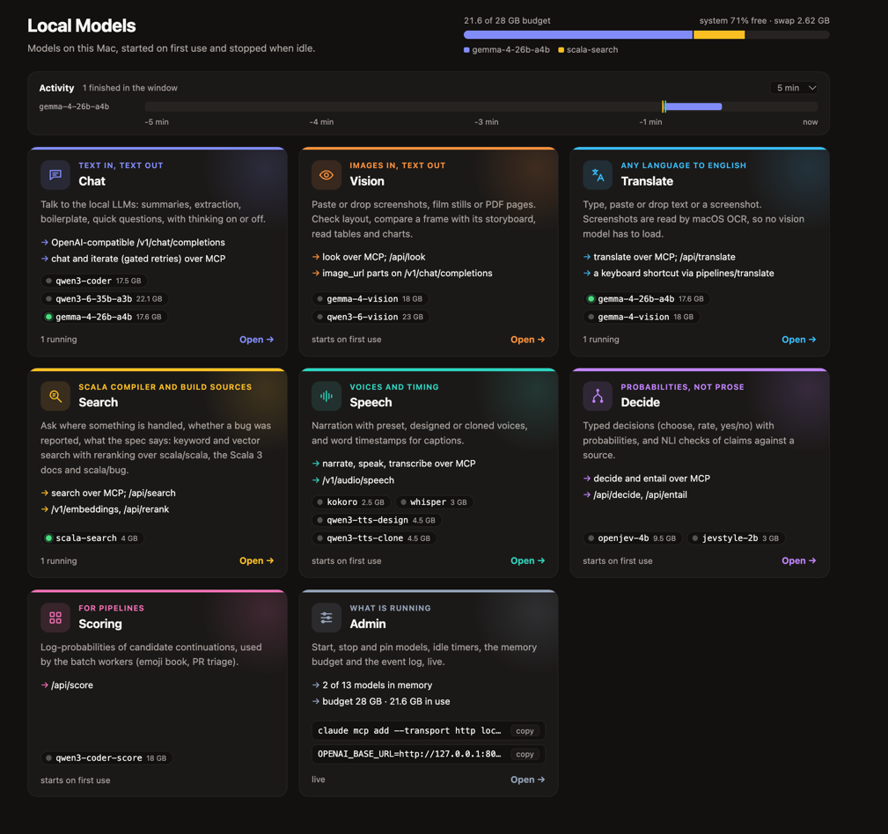
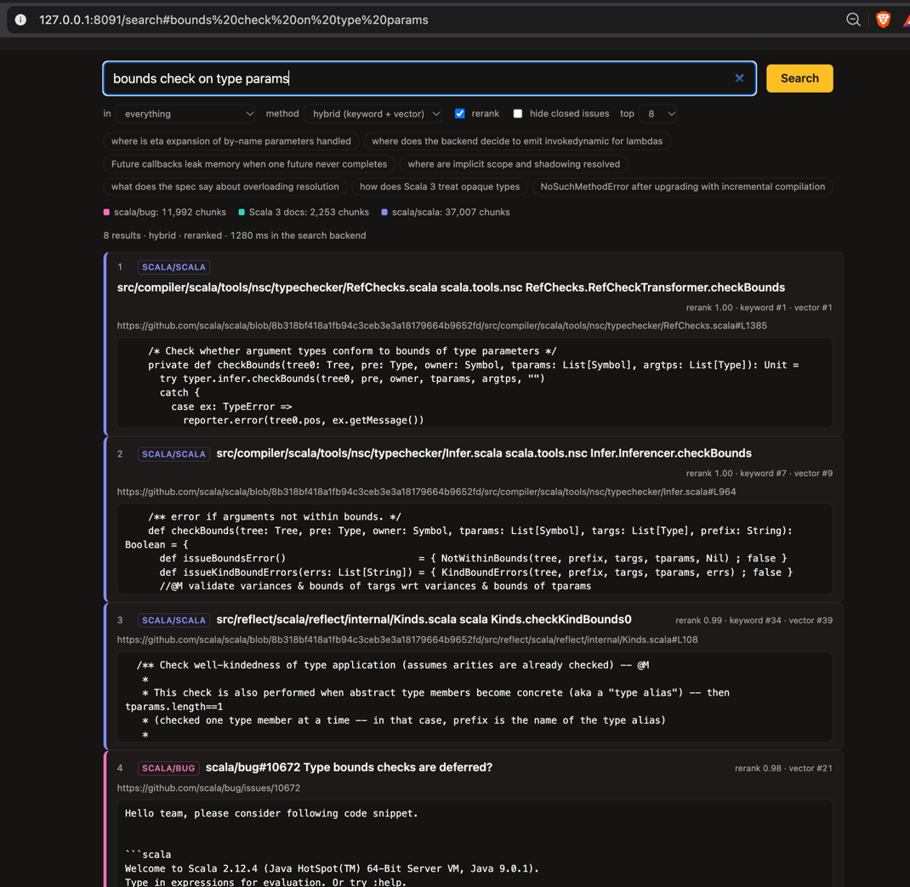
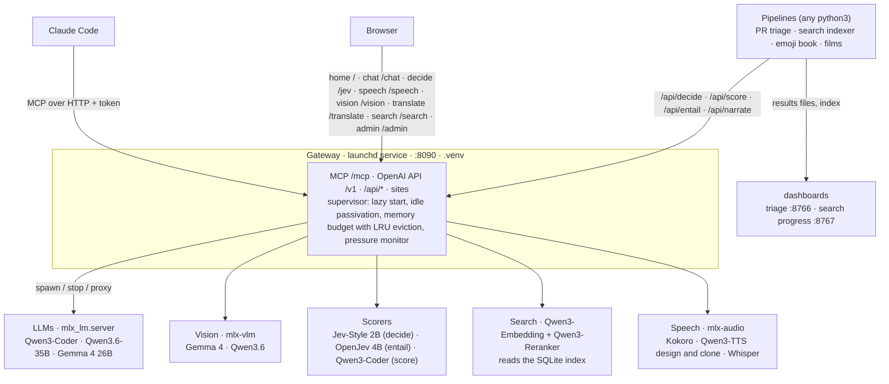

# mlx-lm-setup

**A private, local AI back end for one Mac.** One gateway on `localhost:8090` runs open-weight models on Apple silicon (MLX), starts them on demand, unloads them when idle, and keeps them inside a memory budget. Nothing leaves the machine.

## What you can do with it

- **In the browser:** the pages below.
- **From Claude Code:** the gateway's MCP server delegates cheap, bounded, checkable work to local models; the hosted model keeps design and hard reasoning.
- **From code:** an OpenAI-compatible API at `/v1`, plus `/api/*` endpoints for each capability.

| Capability | Page | MCP tools | What it's for |
|---|---|---|---|
| Chat | `/chat` | `chat`, `iterate` | Streaming local LLM with a model picker; `iterate` retries until JSON, regex, length or faithfulness gates pass |
| Decide | `/jev` | `decide`, `entail` | Score a list of options in one forward pass instead of generating; NLI claim checks |
| Speech | `/speech` | `speak`, `narrate`, `transcribe`, `voices` | Local text-to-speech and word-timed transcripts ([docs/SPEECH.md](docs/SPEECH.md)) |
| Vision | `/vision` | `look` | Layout checks of stills and screenshots, tables and charts in PDF pages |
| Translate | `/translate` | `translate` | Text or a screenshot into English in 1–3 s ([pipelines/translate](pipelines/translate/README.md)) |
| Search | `/search` | `search` | Hybrid search over Scala sources, docs and issues, returning passages with links ([pipelines/search](pipelines/search/README.md)) |
| Operate | `/admin`, `/` | `backends_status`, `start_backend`, `stop_backend`, `set_backend_policy` | Live state, memory, idle timers, pinning, request timeline |

Built on top: [pipelines](#pipelines) for PR triage, search indexing and an emoji-annotated book, and narrated explainer films.

Quick start (needs `brew install mlx-lm`; details under [Chat and MCP](#chat-and-mcp)):

```bash
mise run setup && mise run service-install   # the gateway as a login service (or: .venv/bin/python -m gateway &)
open http://127.0.0.1:8090/
```

## Why

Offload cheap, bounded, verifiable work (summaries, extraction, classification, boilerplate, first-pass triage) to local models so the large hosted model is reserved for design and hard reasoning. The recurring lesson: **models that score a closed set of options in one forward pass (decision models) are far cheaper and more deterministic than generating text**, so most of the interesting pipelines here are deterministic code that calls a scorer, with no text generation in the inner loop. The binding constraint is memory, not speed: the models together do not fit, so every model runs behind the gateway, which starts, evicts and passivates them inside a budget ([PLAN.md](PLAN.md)). Target machine: an M5 Pro Mac with 48 GB unified memory.

## Screenshots

### Home

### Chat

### Decide

### Speech

### Vision

### Translate
Image or Text to Text

### Admin

### Semantic Search


## The models

| Role | Model | Runtime / env | Memory | Used for |
|---|---|---|---|---|
| Generative LLM | Qwen3-Coder-30B-A3B-Instruct, 4-bit (MoE, ~3B active) | `mlx-lm` 0.32 (Homebrew, python 3.14) | ~17 GB | chat, MCP sub-agent; also a separate scoring backend (`qwen3-coder-score`, `/api/score`) for emoji log-probabilities |
| Generative LLM | Qwen3.6-35B-A3B, 4-bit (MoE, 3B active; thinks by default; so does Gemma 4) | `mlx-lm` 0.32 | ~21.5 GB peak | general sub-agent work at speed, long context (small KV cache) |
| Generative LLM | Gemma-4-26B-A4B QAT, 4-bit (MoE, 4B active) | `mlx-lm` 0.32 | ~16 GB peak | safest general default (thinking switched off): passed all six benchmark tasks, smallest memory |
| NLI cross-encoder | OpenJev 4B v5 (Qwen3.5-4B fine-tune; also 2B, 0.8B) | PyTorch on MPS, `.venv-jev` (python 3.12) | ~9 GB | claim verification, PR triage. Slow: no fast kernels for Qwen3.5's linear-attention layers on MPS |
| Decision model | Jev-Style 2B v3 (Qwen3.5-2B fine-tune), 8-bit | MLX, `.venv-mlxjev` (versions pinned, the runtime refuses others) | ~2 GB weights | emoji, colour, mood, sentiment: one pass scores hundreds of options |
| Speech out | Kokoro-82M; Qwen3-TTS 1.7B (voice design, voice clone), 8-bit | `mlx-audio`, `.venv-audio` (python 3.13) | 0.9 GB; 3.7 GB each | narration for video explainers; see [docs/SPEECH.md](docs/SPEECH.md) |
| Speech in | Whisper large-v3-turbo, fp16 | `mlx-audio`, `.venv-audio` | 2 GB | transcripts with word timestamps (captions) |
| Embedder + reranker | Qwen3-Embedding-0.6B and Qwen3-Reranker-0.6B, fp16, one process | PyTorch on MPS, `.venv-jev` | ~3 GB | `/search`, `search`, `/v1/embeddings`, `/api/rerank` |
| Encoder (alternative) | open-jev DeBERTa-v3-large | PyTorch on MPS, `.venv-jev` | 1.7 GB | fast baseline; 512-token cap |

Which LLM to pick for which job, with measurements: **[docs/MODEL_GUIDE.md](docs/MODEL_GUIDE.md)**. Weights live under `models/` (git-ignored) or the Hugging Face cache. The DeBERTa model is used only by benchmarks in `experiments/`.

## Architecture

Every model runs behind the gateway, as its own process in its own environment (their dependency pins conflict). The gateway is the front door for Claude Code (MCP over HTTP), the browser and the pipelines, and its supervisor starts each backend on first use, passivates it when idle, and evicts idle ones least recently used first to stay inside a 28 GB budget. A pressure monitor evicts too when macOS reports low free memory or growing swap.



## Pipelines

### PR triage

Typed yes/no questions about each merged scala/scala PR, scored by the NLI model against the labels maintainers applied (AUROC 0.80 to 0.99, badly calibrated at the default threshold), with a live precision/recall dashboard. See [pipelines/pr_triage](pipelines/pr_triage/README.md).

### Search indexer

Builds the SQLite index (chunks, FTS5, embeddings) over the Scala compiler, Scala 3, its docs, scala/bug and scala/scala PRs that the gateway's `search` backend serves; incremental and resumable, with a progress dashboard. See [pipelines/search](pipelines/search/README.md).

### Emoji book

Alice in Wonderland annotated phrase by phrase: a decision model and an LLM score every emoji per phrase, the scores are fused and rendered as ruby text. See [pipelines/emoji_book](pipelines/emoji_book/README.md).

### Narrated video explainer

`examples/explainer/build.py` builds an MP4 with narration, captions and timed slides from a JSON script, entirely through the gateway's speech API; see [docs/SPEECH.md](docs/SPEECH.md).

[`examples/showcase/`](examples/showcase/) is the ambitious version: a 3-minute motion-design film about this project, rendered with Remotion. Narration is cloned locally, and `[[cue]]` markers in the script are matched to Whisper's word timestamps, so every animation lands on the word that motivates it. The on-screen numbers and screenshots are real. See its [README](examples/showcase/README.md).

[`examples/safe-scala/`](examples/safe-scala/) uses the same machinery for a 2-minute explainer of safe Scala (capture checking, safe mode, TACIT) with a designed voice. Every compiler message on screen comes from compiling the snippets with that day's Scala 3 nightly, and every number from the paper is checked against arXiv before the render.

### Chat and MCP

```bash
brew install mlx-lm                  # one-time
mise run service-install             # the gateway as a launchd login service (also service-status, -logs, -restart, -uninstall, wrapping service/service.sh); or run it by hand:
mise run gateway &                  # chat site, admin site, MCP, OpenAI-compatible API on 127.0.0.1:8090
open http://127.0.0.1:8090/          # home: a panel per page, live model state and memory
mise run admin                       # admin site, authenticated (opens your browser; token travels in the URL fragment only)
./ask.sh "Summarize" < Foo.scala     # one-shot through the gateway
./serve.sh &                         # optional, independent of the gateway: a plain mlx_lm.server on :8080 (use ./ask.sh "..." 8080)
```

The standalone server above is independent of the gateway. Claude Code now talks to the **gateway's own MCP server** (the third-party `mlx-mcp-server` was retired: unregistered, uninstalled; its vetting notes remain in [docs/FINDINGS.md](docs/FINDINGS.md)).

### Gateway

The gateway supervises one process per model: it starts a backend on first request, stops it after its idle TTL, and keeps the resident set inside a memory budget (28 GB by default). When a start would not fit, it evicts the least recently used idle backend; busy and pinned backends are never evicted. A pressure monitor also evicts an idle backend when macOS reports low free memory or growing swap. Design and per-phase measurements: [PLAN.md](PLAN.md).

```bash
curl -N localhost:8090/v1/chat/completions -H 'Content-Type: application/json' \
  -d '{"stream":true,"messages":[{"role":"user","content":"hello"}]}'          # starts Qwen3-Coder on first use
curl localhost:8090/api/backends                 # state, idle countdown, memory estimate per backend, system free memory and swap
```

### Configuring models

Backends are declared in `gateway.toml`; adding a model is a `[backends.<name>]` table using one of the adapters (`mlx_lm`, `mlx_lm_score`, `mlx_vlm`, `jevstyle`, `openjev_nli`, `search`, `mlx_audio_tts`, `mlx_audio_stt`, `command`). Per backend:

- **Memory**: `weights_gb` + `kv_gb` + `overhead_gb` (+ `context_tokens`) instead of one `est_mem_gb`; the KV cache is what long contexts cost. `ttl_s` and `pinned` control passivation.
- **Arguments**: `args = ["--kv-bits", "4", ...]` on `mlx_lm` backends (flags the gateway sets itself are rejected).
- **Profiles**: `[profiles.<name>]` is a named virtual model on an existing backend with request defaults (sampling, token cap, `chat_template_kwargs` such as `enable_thinking`, a system prompt). Client values win; no second process.
- **Description**: shown in the chat page's model picker and `GET /api/models` with memory breakdown, thinking default, context limit and KV cost.
- **Discovery** (read-only): `mise run discover` lists MLX models on disk (HF cache, LM Studio); `mise run discover -- --snippet <id> --context 32768 --kv-bits 4` prints a ready catalog entry. Also `GET /api/models/discovered` and `/api/models/snippet?id=...`.

### Tests

No models needed (a fake backend); CI runs them on macOS.

```bash
mise run test        # creates .venv from requirements.txt
mise run live-check  # against the real models, needs a running gateway
```

## Next

Ideas not yet started are parked under "Future work" in [PLAN.md](PLAN.md).
