# mlx-lm-setup

**A private, local AI back end for one Mac.** One gateway on `localhost:8090` runs open-weight models on Apple silicon (MLX), starts them on demand, unloads them when idle, and keeps them inside a memory budget. Nothing leaves the machine.

## What you can do with it

- **Chat with a local LLM** in the browser (`/`): streaming, tokens per second, a collapsible view of the model's reasoning, markdown and code rendering, a model picker with memory and context details.
- **Decide instead of generate** (`/jev`): give a text, a question and a list of options, and a decision model scores every option in a single forward pass, returning probabilities (pick the best emoji, classify sentiment, triage a bug, rate urgency on a scale). It is fast, deterministic and cheap, and it never generates text.
- **Delegate work from Claude Code** through the gateway's MCP server: `chat`, `decide`, `entail` (does this text support or contradict a claim?) and `iterate` (retry a generation until it passes JSON, regex, length or faithfulness checks), plus the speech tools below. Cheap, bounded, checkable jobs go to the local models; the hosted model keeps design and hard reasoning.
- **Call it from anything** via an OpenAI-compatible API at `/v1`, plus `/api/decide`, `/api/entail` and `/api/score` (log P(candidate | prompt) for a closed list of continuations, from an LLM, without generating).
- **Operate it** from the admin page (`/admin`): live backend state, memory, idle timers, pinning, start and stop.
- **Speak and listen** (`narrate`, `voices`, `speak`, `transcribe`, `/v1/audio/speech`): local text-to-speech with Kokoro and Qwen3-TTS (preset, designed or cloned voices) and Whisper for word timestamps. `narrate` turns scenes with `[[cue]]` markers into clips with word and cue timings, so Claude can narrate and time a video explainer entirely on the Mac ([docs/SPEECH.md](docs/SPEECH.md)).
- **See** (`look`, image parts on `/v1/chat/completions`, `/vision`): Gemma 4 or Qwen3.6 vision on the weights already on disk. Layout checks of film stills and screenshots (overlap, clipping, bad wraps), frames against their storyboard, tables and charts in PDF pages. Paste, drop or point at a directory; the page and the tool return a `flagged` list (PLAN.md, Vision).
- **Translate** (`/translate`, `translate`, `/api/translate`, a macOS Shortcut): text or a screenshot into English (or another language; the page defaults to Polish → English) with a short summary. Screenshots are read by macOS's own OCR (no model load), so a warm translation takes 1–3 s ([pipelines/translate](pipelines/translate/README.md)).
- **Run pipelines on top**: an emoji-annotated edition of *Alice in Wonderland*, an NLI triage of scala/scala pull requests, and narrated explainer films. All are ordinary code that calls the gateway, never a model in process (see [Pipelines](#pipelines)).

Quick start (needs `brew install mlx-lm`; details under [Chat and MCP](#chat-and-mcp)):

```bash
service/service.sh install          # the gateway as a login service (or: .venv/bin/python -m gateway &)
open http://127.0.0.1:8090/
```

## Why

Offload cheap, bounded, verifiable work (summaries, extraction, classification, boilerplate, first-pass triage) to local models so the large hosted model is reserved for design and hard reasoning. The recurring lesson: **models that score a closed set of options in one forward pass (decision models) are far cheaper and more deterministic than generating text**, so most of the interesting pipelines here are deterministic code that calls a scorer, with no text generation in the inner loop. The binding constraint is memory, not speed: the models together do not fit, so every model runs behind the gateway, which starts, evicts and passivates them inside a budget ([PLAN.md](PLAN.md)). Target machine: an M5 Pro Mac with 48 GB unified memory.

## Screenshots

### Home
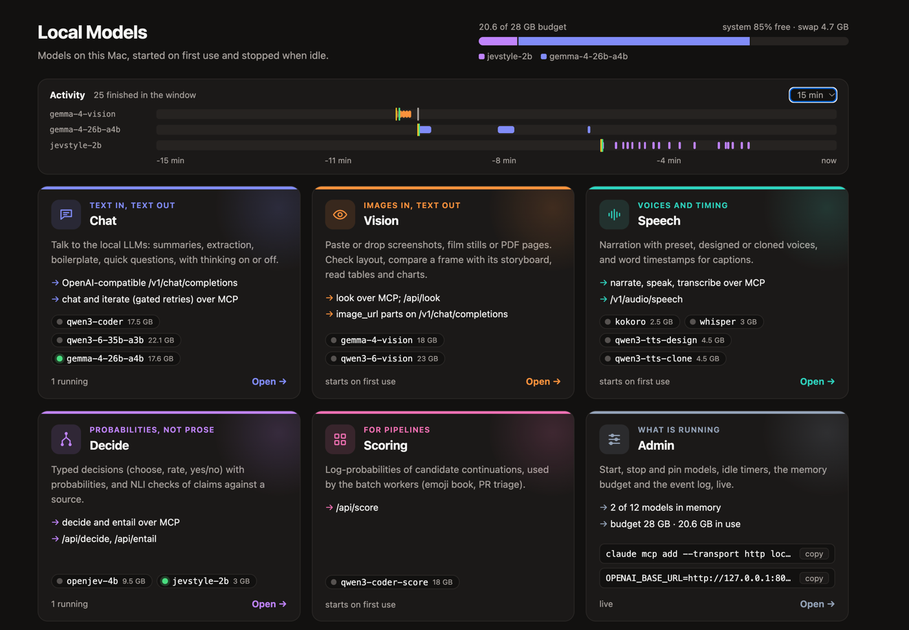
### Chat
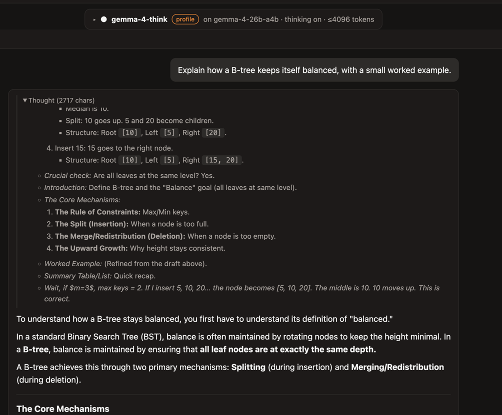
### Decide
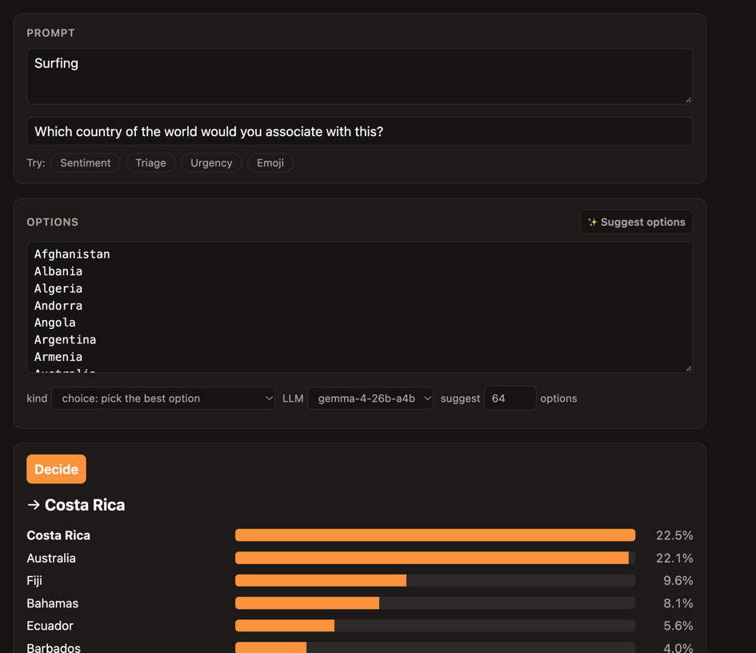
### Speech
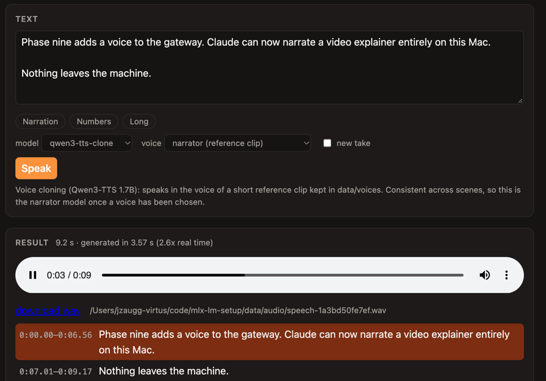
### Vision
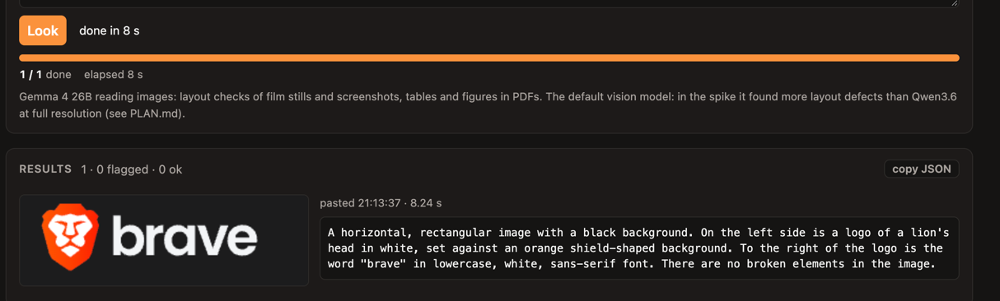
### Translate
Image or Text to Text
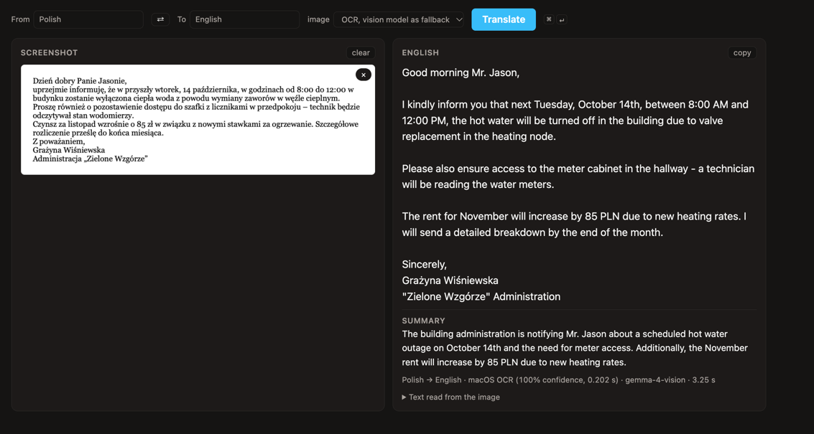
### Admin
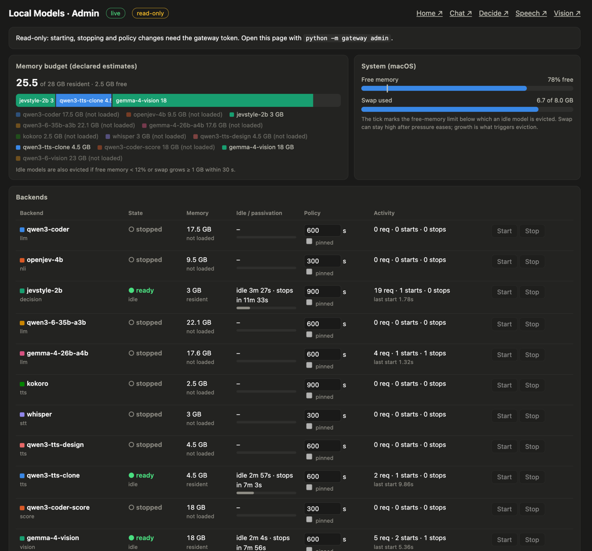

## The models

| Role | Model | Runtime / env | Memory | Used for |
|---|---|---|---|---|
| Generative LLM | Qwen3-Coder-30B-A3B-Instruct, 4-bit (MoE, ~3B active) | `mlx-lm` 0.32 (Homebrew, python 3.14) | ~17 GB | chat, MCP sub-agent; also a separate scoring backend (`qwen3-coder-score`, `/api/score`) for emoji log-probabilities |
| Generative LLM | Qwen3.6-35B-A3B, 4-bit (MoE, 3B active; thinks by default; so does Gemma 4) | `mlx-lm` 0.32 | ~21.5 GB peak | general sub-agent work at speed, long context (small KV cache) |
| Generative LLM | Gemma-4-26B-A4B QAT, 4-bit (MoE, 4B active) | `mlx-lm` 0.32 | ~16 GB peak | safest general default (thinking switched off): passed all six benchmark tasks, smallest memory |
| NLI cross-encoder | OpenJev 4B v5 (Qwen3.5-4B fine-tune; also 2B, 0.8B) | PyTorch on MPS, `.venv-jev` (python 3.12) | ~9 GB | claim verification, PR triage. Slow: no fast kernels for Qwen3.5's linear-attention layers on MPS |
| Decision model | Jev-Style 2B v3 (Qwen3.5-2B fine-tune), 8-bit | MLX, `.venv-mlxjev` (versions pinned, the runtime refuses others) | ~2 GB weights | emoji, colour, mood, sentiment: one pass scores hundreds of options |
| Speech out | Kokoro-82M; Qwen3-TTS 1.7B (voice design, voice clone), 8-bit | `mlx-audio`, `.venv-audio` (python 3.13) | 0.9 GB; 3.7 GB each | narration for video explainers; see [docs/SPEECH.md](docs/SPEECH.md) |
| Speech in | Whisper large-v3-turbo, fp16 | `mlx-audio`, `.venv-audio` | 2 GB | transcripts with word timestamps (captions) |
| Encoder (alternative) | open-jev DeBERTa-v3-large | PyTorch on MPS, `.venv-jev` | 1.7 GB | fast baseline; 512-token cap |

Which LLM to pick for which job, with measurements: **[docs/MODEL_GUIDE.md](docs/MODEL_GUIDE.md)**. Weights live under `models/` (git-ignored) or the Hugging Face cache. The DeBERTa model is used only by benchmarks in `experiments/`.

## Architecture

Every model runs behind the gateway, as its own process in its own environment (their dependency pins conflict). The gateway is the front door for Claude Code (MCP over HTTP), the browser and the pipelines, and its supervisor starts each backend on first use, passivates it when idle, and evicts idle ones least recently used first to stay inside a 28 GB budget. A pressure monitor evicts too when macOS reports low free memory or growing swap.

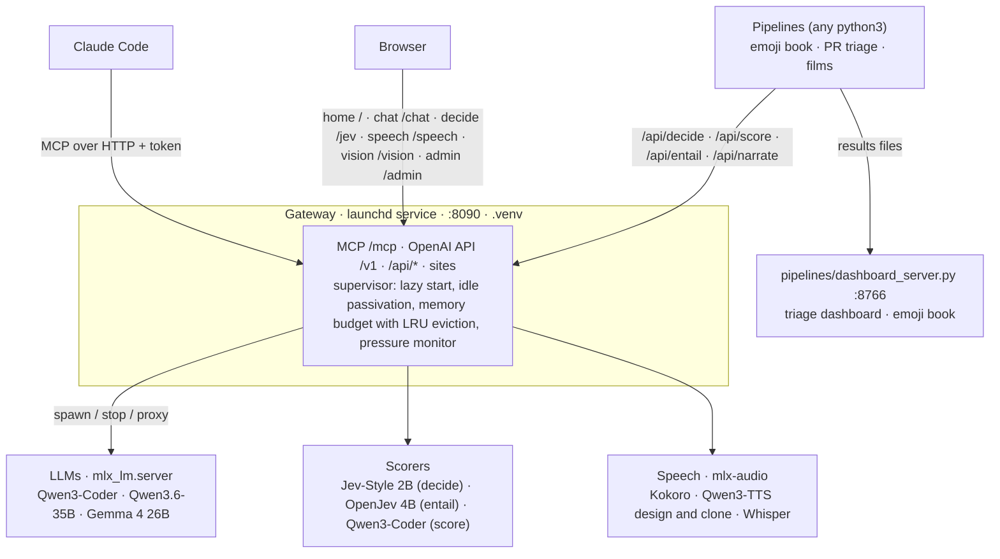

## Pipelines

### Emoji book: Alice annotated phrase by phrase

Deterministic code around scorers: spaCy cuts the text into phrases, a decision model and an LLM score every emoji, the scores are fused, and the page renders them as ruby text above each phrase, tinted by the "vibe colour" when the model is confident.

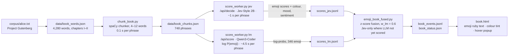

What one decision-model call looks like (this is why attributes are nearly free: the state is computed once and every extra question only adds its own options):

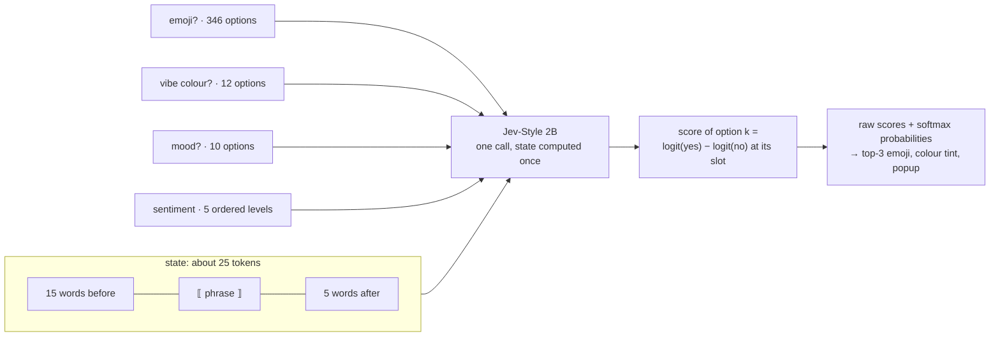

The workers call the gateway (`pipelines/gateway_client.py`, stdlib only), so they run under any `python3` and never load a model; run them one at a time, since they share the GPU. The chunker and the fusion step need spaCy and numpy from `.venv-jev`.

```bash
.venv-jev/bin/python pipelines/emoji_book/chunk_book.py        # phrase boundaries -> data/book_chunks.json
python3 pipelines/emoji_book/score_worker.py jev               # resumable; --fresh to restart
python3 pipelines/emoji_book/score_worker.py lm                # optional: the gateway evicts idle backends to fit the 18 GB scorer
.venv-jev/bin/python pipelines/emoji_book/emoji_book_fused.py --fresh     # combine -> data/book_events.jsonl (follows the workers live)
python3 pipelines/dashboard_server.py &                        # http://127.0.0.1:8766/book
```

`recolor.py` re-answers only the colour question for phrases already scored, so prompt wording can be iterated quickly. Questions and the context window live in `jev_attrs.py`, the LLM's few-shot prompt in `lm_prompt.py`, the emoji list in `emoji_vocab.py`.

### PR triage: OpenJev on scala/scala

Typed yes/no questions about each merged PR (title, changed files, start of the description; no diff), scored against the labels maintainers actually applied. 300 PRs, 1.24 s each, AUROC 0.80 to 0.99 but badly calibrated at the default threshold; see the findings log.

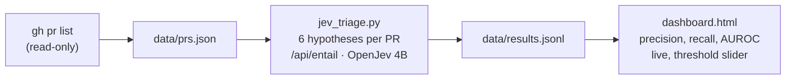

```bash
gh pr list -R scala/scala --state merged --limit 300 --json number,title,body,labels,files,mergedAt,author > data/prs.json
python3 pipelines/dashboard_server.py &                  # http://127.0.0.1:8766/
python3 pipelines/pr_triage/jev_triage.py --fresh
```

### Narrated video explainer

`examples/explainer/build.py` builds an MP4 with narration, captions and timed slides from a JSON script, entirely through the gateway's speech API; see [docs/SPEECH.md](docs/SPEECH.md).

[`examples/showcase/`](examples/showcase/) is the ambitious version: a 3-minute motion-design film about this project, rendered with Remotion. Narration is cloned locally, and `[[cue]]` markers in the script are matched to Whisper's word timestamps, so every animation lands on the word that motivates it. The on-screen numbers and screenshots are real. See its [README](examples/showcase/README.md).

[`examples/safe-scala/`](examples/safe-scala/) uses the same machinery for a 2-minute explainer of safe Scala (capture checking, safe mode, TACIT) with a designed voice. Every compiler message on screen comes from compiling the snippets with that day's Scala 3 nightly, and every number from the paper is checked against arXiv before the render.

### Chat and MCP

```bash
brew install mlx-lm                  # one-time
service/service.sh install           # the gateway as a launchd login service (status, logs, restart, uninstall); or run it by hand:
.venv/bin/python -m gateway &        # chat site, admin site, MCP, OpenAI-compatible API on 127.0.0.1:8090
open http://127.0.0.1:8090/          # chat site: streaming, tok/s, shows "starting model..." on a cold start
open http://127.0.0.1:8090/jev       # decision-model site: prompt + question + options; ✨ asks a local LLM (Gemma) to propose the options
open http://127.0.0.1:8090/speech    # speech site: voices, timings, word-level transcript
open http://127.0.0.1:8090/vision    # vision: paste or drop images, layout check, storyboard, tables
open http://127.0.0.1:8090/translate # translate: text or a pasted screenshot, Polish → English by default
open http://127.0.0.1:8090/          # home: one panel per section, live model state and memory
python -m gateway admin              # admin site, authenticated (opens your browser; token travels in the URL fragment only)
./ask.sh "Summarize" < Foo.scala     # one-shot through the gateway
./serve.sh &                         # optional, independent of the gateway: a plain mlx_lm.server on :8080 (use ./ask.sh "..." 8080)
```

The standalone server above is independent of the gateway. Claude Code now talks to the **gateway's own MCP server** (the third-party `mlx-mcp-server` was retired: unregistered, uninstalled; its vetting notes remain in [docs/FINDINGS.md](docs/FINDINGS.md)).

### Gateway MCP tools

```bash
service/service.sh status              # the gateway must be running for Claude Code to connect
./register_mcp.sh                      # claude mcp add --transport http ... with the token header; restart Claude Code after
```

| Tool | What | Token |
|---|---|---|
| `chat` | local LLM (default Qwen3-Coder); `message` or `messages`, optional `system` | no |
| `decide` | typed decisions with probabilities from the decision model: one `question` + `options`, or several `questions` about one state | no |
| `entail` | NLI: is each hypothesis entailed by / contradicted by / neutral to a premise | no |
| `iterate` | `chat` with retries until the answer passes gates: JSON (+schema), regex, contains, length, NLI faithfulness to a source text; optional escalation model for the last try; no shell gate | no |
| `speak` | text to speech (Kokoro presets, Qwen3-TTS designed or cloned voices): wav path, duration and per-sentence timings | no |
| `transcribe` | speech to text with word timestamps, for captions and for checking a `speak` clip | no |
| `look` | a vision model reads images, directories or PDF pages; presets `layout`, `storyboard`, `table`, `describe`; per-image `flagged` list | no |
| `translate` | text or a screenshot into English with a summary; screenshots via macOS OCR, the vision model as fallback | no |
| `narrate` | timed narration: scenes with `[[cue]]` markers in; per scene a clip, its duration, word timestamps and cue times out | no |
| `voices` | the speech models, their preset voices and the saved reference voices | no |
| `backends_status` | state, memory, idle timers, budget, system free memory and swap; starts nothing | no |
| `start_backend`, `stop_backend`, `set_backend_policy` | change what is running; TTL and pin | **yes** |

State-changing tools need the token in the `Authorization: Bearer` header (the registration script adds it; the token lives in `.gateway/token`, mode 0600, created on first run; `python -m gateway token` prints it). Inference and status are open on localhost. `.venv/bin/python -m gateway.live_check` exercises every tool against a running gateway with the real models.

## What we measured (headlines)

| Question | Answer |
|---|---|
| Qwen3-Coder-30B speed and memory | ~103 tok/s generation, 17.2 GB peak. Good at gated extraction, boilerplate, long-file summaries; unreliable at open-ended review (hallucinated a bug). |
| Why was OpenJev 4B NLI slow (33 s per 343 emoji)? | Qwen3.5's linear-attention layers fall back to pure PyTorch on MPS: 96% of time in copies, cost independent of model size. |
| What fixed it? | A model that scores all options in one pass on native MLX: Jev-Style 2B, 0.9 s for all 346 emoji (37x faster). |
| Group pruning of emoji candidates | Bad idea: loses half of the good answers. |
| Whole-chapter context | Worse (collapses onto chapter gist, 2x slower). A 15-before / 5-after word window is free and better. |
| Glyph-only emoji options vs names | Not better for the 2B model; some glyph knowledge exists (🍆 rank 203 → 5). |
| LLM next-token emoji scoring | Knows slang (💀 🐐 🔥 🤡 👻); noisier on narrative. Fusion with the decision model: slang top-1 13/22 (Jev alone) and 15/22 (LLM alone) → 17–18/22 fused. |
| Memory | Before the gateway: LLM + an in-process copy for the emoji worker + decision model + browsers → 6 of 7 GB swap and a thrashing machine. Now every model is a budgeted backend and idle ones are evicted. |

Details, tables and dead ends: [docs/FINDINGS.md](docs/FINDINGS.md).

## Files

| Path | What |
|---|---|
| `gateway/`, `gateway.toml` | the gateway: catalog, supervisor, HTTP app, MCP server, thin backend servers (`gateway/backends/`), sites (`gateway/web/`) |
| `service/` | launchd service: `service.sh install / uninstall / restart / status / logs` |
| `pipelines/` | what runs today, all as gateway clients: `emoji_book/`, `pr_triage/`, `translate/` (the Shortcut's client), `dashboard_server.py` (whitelist-only localhost server for both pages), `gateway_client.py` |
| `examples/` | narrated films: `explainer/` (slides), `showcase/`, `safe-scala/` |
| `experiments/` | benchmarks and earlier in-process iterations behind the choices above, kept for reference (`bench_llm_compare.py`: the head-to-head in the model guide) |
| `ask.sh`, `serve.sh`, `register_mcp.sh` | one-shot client, a plain `mlx_lm.server` outside the gateway, MCP registration |
| `docs/` | `FINDINGS.md` (long-form log of what was tried), `MODEL_GUIDE.md` (which model when), `SPEECH.md` |
| `PLAN.md` | the gateway's design and phase status, with findings per phase |
| `data/`, `models/`, `corpus/`, `.venv*/` | generated or downloaded; git-ignored (logs in `data/logs/`) |

Environments: `.venv` (the gateway: `mcp[cli]<2`, uvicorn, httpx, and `pyobjc-framework-Vision` for OCR in `translate`), `.venv-audio` (mlx-audio for speech, python 3.13; setup in [docs/SPEECH.md](docs/SPEECH.md)), `.venv-jev` (torch, transformers, spaCy: the OpenJev backend, the chunker and the fusion step), `.venv-mlxjev` (pinned `mlx==0.32.2 mlx-lm==0.31.3 transformers==5.17.0 tokenizers==0.23.2 numpy==2.5.3`, for the Jev-Style backend), and Homebrew's `mlx-lm` for the LLM backends. They exist because the dependency pins conflict, which is why each model runs as a separate process.

## Gateway

Starts models on demand, passivates idle ones, and fronts them with one API. All phases in [PLAN.md](PLAN.md) are done: catalog, supervisor, HTTP proxy, MCP tools, gated `iterate`, chat and admin sites, memory budget, launchd service, speech, and the pipelines as clients. **Memory is managed**: a 28 GB budget with least-recently-used eviction of idle backends (busy and pinned ones are never evicted), plus a pressure monitor that evicts an idle backend when macOS reports low free memory or growing swap.

```bash
curl -N localhost:8090/v1/chat/completions -H 'Content-Type: application/json' \
  -d '{"stream":true,"messages":[{"role":"user","content":"hello"}]}'          # starts Qwen3-Coder on first use
curl localhost:8090/api/backends                 # state, idle countdown, memory estimate per backend, system free memory and swap
```

Add a model by adding a `[backends.<name>]` table to `gateway.toml` (adapters: `mlx_lm`, `mlx_lm_score`, `jevstyle`, `openjev_nli`, `mlx_audio_tts`, `mlx_audio_stt`, `command`). The catalog has these features for managing models:

- **Memory as parts**: give `weights_gb` + `kv_gb` + `overhead_gb` (+ `context_tokens`) instead of one `est_mem_gb`; the KV cache is what long contexts cost.
- **Argument passthrough**: `args = ["--kv-bits", "4", ...]` on `mlx_lm` backends (flags the gateway sets itself are rejected).
- **Profiles**: `[profiles.<name>]` is a named virtual model on an existing backend with request defaults (sampling, a token cap, `chat_template_kwargs` such as `enable_thinking`, a system prompt). Fill-only: whatever the client sends wins. No second process.
- **Model picker details**: give each backend a `description`; the chat page's dropdown (and `GET /api/models`) then shows, per model and profile, what it is, memory breakdown, thinking default, context limit and KV cost, the defaults a profile applies, and live load/idle state.
- **Discovery** (read-only): `python -m gateway.cli discover` lists MLX models on disk (HF cache, LM Studio) with size, KV cost and mlx-lm support; `discover --snippet <id> --context 32768 --kv-bits 4` prints a ready catalog entry. Also `GET /api/models/discovered` and `/api/models/snippet?id=...`.

Tests (no models needed, they use a fake backend; CI runs them on macOS): `mise run test` (creates `.venv` from `requirements.txt`), or `.venv/bin/python -m unittest discover -s gateway/tests -t .`; against the real models: `.venv/bin/python -m gateway.live_check`.

## Next

Ideas not yet started are parked under "Future work" in [PLAN.md](PLAN.md).
