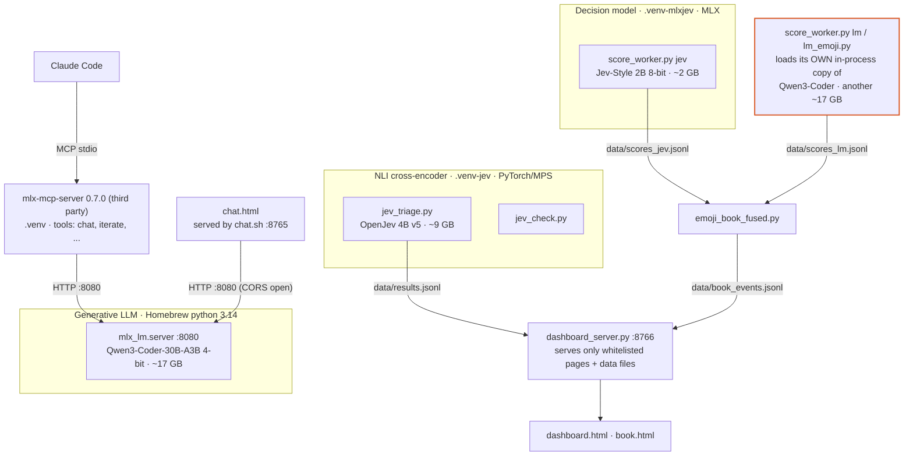
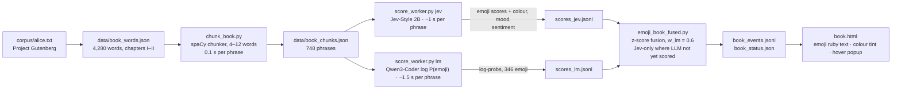
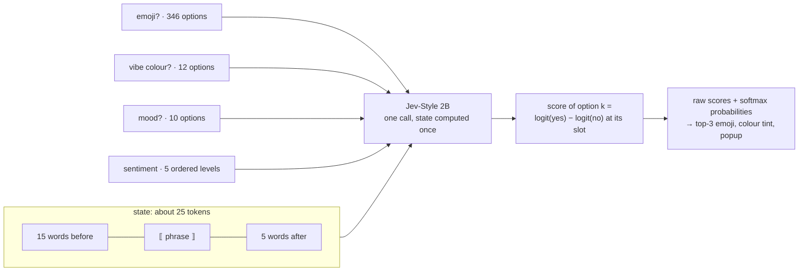
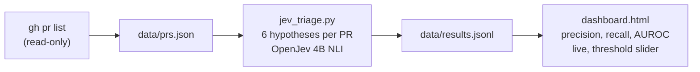

# mlx-lm-setup

A local model workbench for an M5 Pro Mac (48 GB unified memory): a generative coding LLM, two "decision"-style models, and the scripts, pipelines and web pages built around them. Everything runs on localhost; prompts and code never leave the machine.

## Why

Offload cheap, bounded, verifiable work (summaries, extraction, classification, boilerplate, first-pass triage) to local models so the large hosted model is reserved for design and hard reasoning. The recurring lesson: **models that score a closed set of options in one forward pass (decision models) are far cheaper and more deterministic than generating text**, so most of the interesting pipelines here are deterministic code that calls a scorer, with no text generation in the inner loop. The binding constraint is memory, not speed: the models together do not fit comfortably, which is what [PLAN.md](PLAN.md) addresses.

## The models

| Role | Model | Runtime / env | Memory | Used for |
|---|---|---|---|---|
| Generative LLM | Qwen3-Coder-30B-A3B-Instruct, 4-bit (MoE, ~3B active) | `mlx-lm` 0.32 (Homebrew, python 3.14) | ~17 GB | chat, MCP sub-agent, emoji next-token scoring (`lm_emoji.py`) |
| NLI cross-encoder | OpenJev 4B v5 (Qwen3.5-4B fine-tune; also 2B, 0.8B) | PyTorch on MPS, `.venv-jev` (python 3.12) | ~9 GB | claim verification, PR triage. Slow: no fast kernels for Qwen3.5's linear-attention layers on MPS |
| Decision model | Jev-Style 2B v3 (Qwen3.5-2B fine-tune), 8-bit | MLX, `.venv-mlxjev` (versions pinned, the runtime refuses others) | ~2 GB weights | emoji, colour, mood, sentiment: one pass scores hundreds of options |
| Encoder (alternative) | open-jev DeBERTa-v3-large | PyTorch on MPS, `.venv-jev` | 1.7 GB | fast baseline; 512-token cap |

Weights live under `models/` (git-ignored) or the Hugging Face cache. The 4B NLI and the DeBERTa model are not currently used by any pipeline, only by benchmarks and the triage demo.

## Architecture today

Each model is its own script, venv and (sometimes) port. There is no lifecycle management: you start and stop things by hand, and two heavy models together push the machine into swap.



Note the orange box: the LLM emoji worker does not talk to the `mlx_lm.server` on :8080; it loads a second copy of the same 17 GB model. Running both is how the machine ended up with 6 GB of swap.

## Pipelines

### Emoji book: Alice annotated phrase by phrase

Deterministic code around scorers: spaCy cuts the text into phrases, a decision model and an LLM score every emoji, the scores are fused, and the page renders them as ruby text above each phrase, tinted by the "vibe colour" when the model is confident.



What one decision-model call looks like (this is why attributes are nearly free: the state is computed once and every extra question only adds its own options):



```bash
.venv-jev/bin/python chunk_book.py                                    # phrase boundaries -> data/book_chunks.json
.venv-mlxjev/bin/python score_worker.py jev                           # resumable; --fresh to restart
/opt/homebrew/opt/mlx-lm/libexec/bin/python score_worker.py lm        # optional, 17 GB: run ALONE, not beside other heavy models
.venv-jev/bin/python emoji_book_fused.py --fresh                      # combine -> data/book_events.jsonl
python3 dashboard_server.py &                                         # http://127.0.0.1:8766/book
```

`recolor.py` re-answers only the colour question for phrases already scored (170 phrases in 9 s), so prompt wording can be iterated quickly. Questions and the context window live in `jev_attrs.py`; the emoji list in `emoji_vocab.py`.

### PR triage: OpenJev on scala/scala

Typed yes/no questions about each merged PR (title, changed files, start of the description; no diff), scored against the labels maintainers actually applied. 300 PRs, 1.24 s each, AUROC 0.80 to 0.99 but badly calibrated at the default threshold; see the findings log.



```bash
gh pr list -R scala/scala --state merged --limit 300 --json number,title,body,labels,files,mergedAt,author > data/prs.json
python3 dashboard_server.py &                      # http://127.0.0.1:8766/
.venv-jev/bin/python jev_triage.py --fresh
```

### Chat and MCP

```bash
brew install mlx-lm                  # one-time
./serve.sh &                         # mlx_lm.server on 127.0.0.1:8080 (OpenAI-compatible, localhost only)
./chat.sh                            # chat UI at http://127.0.0.1:8765/chat.html (streaming, tok/s)
./ask.sh "Summarize" < Foo.scala     # one-shot
```

The MCP bridge is the third-party `mlx-mcp-server` 0.7.0 in `.venv`, registered in Claude Code at local scope (tools: `chat`, `iterate`, `quick_test`, `set_model`, `health_check`, `list_models`). It only forwards to :8080. Do not run its own `install` command (it writes to `~/.claude/settings.json`); register it with:

```bash
claude mcp add mlx --scope local -e MLX_BASE_URL=http://127.0.0.1:8080 \
  -e MLX_DEFAULT_MODEL=mlx-community/Qwen3-Coder-30B-A3B-Instruct-4bit -e MLX_TIMEOUT=300 \
  -- "$PWD/.venv/bin/mlx-mcp-server"
```

## What we measured (headlines)

| Question | Answer |
|---|---|
| Qwen3-Coder-30B speed and memory | ~103 tok/s generation, 17.2 GB peak. Good at gated extraction, boilerplate, long-file summaries; unreliable at open-ended review (hallucinated a bug). |
| Why was OpenJev 4B NLI slow (33 s per 343 emoji)? | Qwen3.5's linear-attention layers fall back to pure PyTorch on MPS: 96% of time in copies, cost independent of model size. |
| What fixed it? | A model that scores all options in one pass on native MLX: Jev-Style 2B, 0.9 s for all 346 emoji (37x faster). |
| Group pruning of emoji candidates | Bad idea: loses half of the good answers. |
| Whole-chapter context | Worse (collapses onto chapter gist, 2x slower). A 15-before / 5-after word window is free and better. |
| Glyph-only emoji options vs names | Not better for the 2B model; some glyph knowledge exists (🍆 rank 203 → 5). |
| LLM next-token emoji scoring | Knows slang (💀 🐐 🔥 🤡 👻); noisier on narrative. Fusion with the decision model: slang top-1 13/22 (Jev alone) and 15/22 (LLM alone) → 17–18/22 fused. |
| Memory | LLM + decision model + browsers → 6 of 7 GB swap and a thrashing machine. Run heavy models one at a time. |

Details, tables and dead ends: [docs/FINDINGS.md](docs/FINDINGS.md).

## Files

| Path | What |
|---|---|
| `serve.sh`, `ask.sh`, `chat.sh`, `chat.html` | LLM server, one-shot client, chat UI |
| `dashboard_server.py`, `dashboard.html`, `book.html` | whitelist-only localhost server; triage dashboard; emoji book |
| `score_worker.py`, `jev_attrs.py`, `lm_emoji.py`, `emoji_book_fused.py`, `emoji_vocab.py`, `chunker_spacy.py`, `chunk_book.py`, `recolor.py` | emoji book pipeline (current) |
| `emoji_book.py`, `emoji_book_mlx.py` | earlier pipeline iterations, kept for reference |
| `jev_check.py`, `jev_triage.py` | OpenJev NLI wrapper and PR triage |
| `bench_*.py`, `fuse_*.py`, `bench_all.sh`, `run_fused.sh` | benchmarks and fusion experiments |
| `test_mcp.py` | stdio smoke test of the MCP bridge |
| `data/`, `models/`, `corpus/`, `.venv*/`, `*.log` | generated or downloaded; git-ignored |
| `docs/FINDINGS.md` | long-form log of what was tried |
| `PLAN.md` | design for the model gateway (lifecycle, passivation, MCP, web) and its phase status |
| `gateway.toml`, `gateway/` | gateway: catalog (`python -m gateway.catalog`), supervisor, HTTP app (`python -m gateway`), thin backend servers for the decision and NLI models; supervisor in `gateway/supervisor.py`, driver: `python -m gateway.cli demo jevstyle-2b --ttl 5`; all tests: `.venv/bin/python -m unittest discover -s gateway/tests -t .` (phases 1-3 and 6 done: catalog, supervisor, HTTP front door, memory budget) |

Environments: `.venv` (MCP bridge, `mcp<2`), `.venv-jev` (torch, transformers, spaCy), `.venv-mlxjev` (pinned `mlx==0.32.2 mlx-lm==0.31.3 transformers==5.17.0 tokenizers==0.23.2 numpy==2.5.3`). Two of these exist because dependency pins conflict, which is one reason the planned gateway runs each model as a separate process.

## Gateway (in progress)

A localhost gateway that starts models on demand, passivates idle ones, and fronts them with one API. Phases 1-3 and 6 are built (catalog, supervisor, HTTP proxy, memory budget); MCP tools, the admin and chat sites and launchd come next (see [PLAN.md](PLAN.md)). **Memory is managed**: a 28 GB budget with least-recently-used eviction of idle backends (busy and pinned ones are never evicted), plus a pressure monitor that evicts an idle backend when macOS reports low free memory or growing swap.

```bash
.venv/bin/python -m gateway                      # http://127.0.0.1:8090, backends start lazily, stop on idle or SIGTERM
curl -N localhost:8090/v1/chat/completions -H 'Content-Type: application/json' \
  -d '{"stream":true,"messages":[{"role":"user","content":"hello"}]}'          # starts Qwen3-Coder on first use
curl localhost:8090/api/backends                 # state, idle countdown, memory estimate per backend
```

Add a model by adding a `[backends.<name>]` table to `gateway.toml` (adapters: `mlx_lm`, `jevstyle`, `openjev_nli`, `command`). Tests (no models needed, they use a fake backend): `.venv/bin/python -m unittest discover -s gateway/tests -t .`

## Next

[PLAN.md](PLAN.md): a long-lived local gateway that starts, stops and passivates (unloads when idle, reloads on demand) the models, extends the MCP interface with lifecycle tools, and serves the chat site and an admin site.
