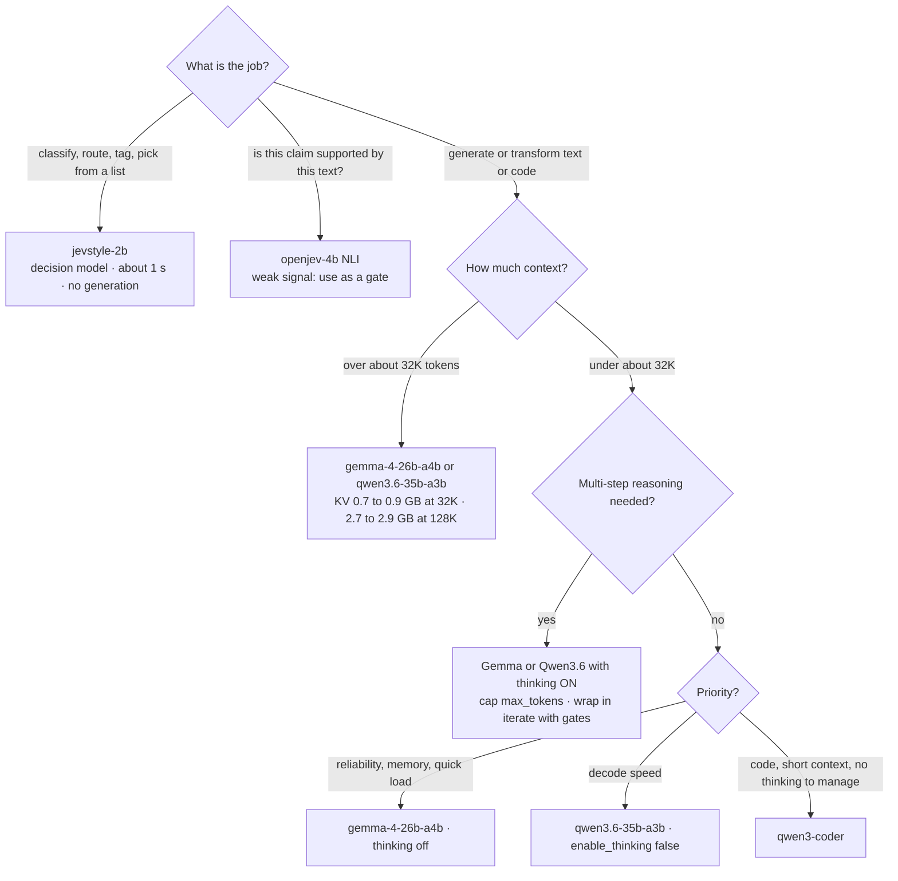

# Which model when

A decision guide for the gateway's catalog on this machine (M5 Pro, 48 GB, gateway memory budget 28 GB). Everything below is measured here unless marked as an estimate or untested. Reproduce the LLM numbers with `bench_llm_compare.py` (one model per process); the raw results are written to `data/llm_bench_<label>.json`.

## Short version

| If the job is... | Pick | Why |
|---|---|---|
| Classify, route, tag, choose from a list, rate on a scale | **`jevstyle-2b`** (decision model) | One pass scores hundreds of options in about a second, nothing is generated, deterministic |
| Check whether a text supports a claim | **`openjev-4b`** (NLI) | Entailment / contradiction / neutral per claim. A weak signal: it missed 1 of 5 in our test. Use it as a gate, not a verdict |
| General sub-agent work (extraction, boilerplate, short reviews, reformatting) and you want the safest default | **`gemma-4-26b-a4b`**, thinking off | Only model to pass all six tasks, smallest memory (16 GB peak), fastest load. Thinking is off by default in the catalog (see Thinking) |
| Same, and decode speed matters most | **`qwen3.6-35b-a3b`** with `enable_thinking: false` | About 104 tok/s vs 85 for Gemma, 5 of 6 tasks |
| Code-focused work where its code training matters (and short context) | **`qwen3-coder`** | About 108 tok/s, 5 of 6 tasks, no thinking mode to manage. Weakest at long context (see below) |
| Contexts above about 32K tokens | **`gemma-4-26b-a4b`** or **`qwen3.6-35b-a3b`** | KV cache is about 20 KiB per token vs 96 KiB for Qwen3-Coder: 2.7 to 2.9 GB at 128K instead of 12.9 GB |
| A task that needs multi-step reasoning | **Gemma or Qwen3.6 with thinking on**, with a token cap, ideally through `iterate` with gates | Thinking costs about 18x more tokens and can run away (see Thinking) |

Only one LLM fits next to the others at a time under the 28 GB budget; the gateway evicts the least recently used idle backend.

## The flow



## What we measured

Six sub-agent-style tasks with mechanically checkable answers: JSON extraction from Scala, Python codegen (executed against asserts), spotting the bug in a moving average, Scala `foldLeft`/`foldRight` arithmetic, listing the public methods of a 5.8k to 6.9k token Python module (long-context recall), and a strict 3-bullet format. One run per cell at temperature 0.3.

| Model, mode | Tasks passed | Decode tok/s (median) | Prefill at 6k tokens | Peak memory | Load |
|---|---|---|---|---|---|
| qwen3-coder (no thinking mode) | 5/6 | 107.7 | 2,564 tok/s | 18.4 GB | 4.5 s |
| qwen3.6-35b-a3b, thinking off | 5/6 | 103.6 | 2,648 tok/s | 21.5 GB | 4.1 s |
| qwen3.6-35b-a3b, thinking on | 5/6 | 100.4 | 2,990 tok/s | 21.5 GB | 4.1 s |
| gemma-4-26b-a4b, thinking off | **6/6** | 85.0 | 2,152 tok/s | **16.0 GB** | **2.6 s** |
| gemma-4-26b-a4b, thinking on | 5/6 | 80.4 | 2,490 tok/s | 16.0 GB | 2.6 s |

| Task | qwen3-coder | qwen3.6 off / on | gemma-4 off / on |
|---|---|---|---|
| JSON extraction | ok | ok / ok | ok / ok |
| Codegen with asserts | ok | ok / **fail (looped, 4,100 tokens)** | ok / ok |
| Spot the bug | ok | ok / ok | ok / ok |
| Scala fold arithmetic | ok | ok / ok (4,100-token cap hit) | ok / ok |
| Long-context method list | **fail (repetition loop)** | fail (12 of 16 names) / ok | ok / ok |
| Strict 3-bullet format | ok | ok / ok | ok / **fail (runaway, 3,800 tokens)** |

Read the failures, not just the count:
- **Qwen3-Coder** answered the long-context question with "ensure_running, start, stop, ..., snapshot, snapshot, snapshot, ..." until the token cap: a repetition loop on a 5.8k-token prompt. Its code-review answer was correct.
- **Qwen3.6, thinking off,** returned only 12 of 16 method names, all real (precision 1.0): incomplete, not wrong.
- **Qwen3.6, thinking on,** did not finish the codegen task within 4,100 tokens (no closing reasoning marker was found, so it was probably still thinking), and spent 3,896 reasoning tokens on a two-line arithmetic question.
- **Gemma 4, thinking on,** wrote a 231-line list for a "3 bullets" request.

## Thinking is a cost you must manage

| | Thinking off | Thinking on |
|---|---|---|
| Qwen3.6: mean tokens per task | 127 | 2,342 (2 of 6 hit the cap) |
| Gemma 4: mean tokens per task | 81 | 1,465 (1 of 6 hit the cap) |
| Wall time per task | 0.4 to 5 s | 3 to 49 s |

- **Qwen3.6 thinks by default**: its chat template opens a `<think>` block, so any client that does not say otherwise pays the thinking cost on every request. `mlx_lm.server` returns the reasoning in a separate `reasoning` field and leaves `content` empty if the token limit is reached first, so a naive client sees an empty answer. Send `chat_template_kwargs: {"enable_thinking": false}` for quick tasks. `mlx_lm.server` accepts that per request, and `--chat-template-args '{"enable_thinking":false}'` sets it server-wide.
- **Gemma 4 also thinks by default under `mlx-lm`.** Found live through the gateway: a default request returned only reasoning and hit the token limit with no answer, while `enable_thinking: false` answered in 35 tokens. (My first template check, done through a different tokenizer loader, wrongly showed Gemma as off. The benchmark is unaffected because it passed the flag explicitly in both modes.)
- **Qwen3-Coder has no thinking mode.**
- **In the catalog** both Qwen3.6 and Gemma 4 are started with thinking off (`args = ["--chat-template-args", '{"enable_thinking": false}']`), so a plain request gets a direct answer: verified live, 39 and 35 tokens instead of a 600-token reasoning-only reply. A request can still switch it on with `chat_template_kwargs: {"enable_thinking": true}`, and the profiles `qwen3-6-think` and `gemma-4-think` (aliases `qwen-think`, `gemma-think`) do that with `max_tokens` 4096 so a runaway stops.
- Thinking helped where the answer needed it (Qwen3.6 got the long-context list fully right with it, 16 of 16 names; Gemma stayed correct), but it also produced the only runaway generations. Always set `max_tokens` when thinking is on, and prefer `iterate` with a gate so a runaway fails fast and retries.

## Memory and context

Weights are only part of the bill: the KV cache grows with context. Sizes below are computed from each model's `config.json` (fp16 KV; an estimate, not a measurement). Qwen3.6 keeps KV in only 10 of its 40 layers (the rest are linear-attention with a small constant state); Gemma 4 keeps full KV in only 5 of 30 layers and caps the other 25 at a 1,024-token window; Qwen3-Coder keeps KV in all 48.

| Model | KV per token | 8K | 32K | 128K | 256K | 128K with 4-bit KV |
|---|---|---|---|---|---|---|
| qwen3-coder | 96 KiB | 0.8 GB | 3.2 GB | 12.9 GB | 25.8 GB | 3.6 GB |
| qwen3.6-35b-a3b | 20 KiB | 0.2 GB | 0.7 GB | 2.7 GB | 5.4 GB | 0.8 GB |
| gemma-4-26b-a4b | 20 KiB | 0.4 GB | 0.9 GB | 2.9 GB | 5.6 GB | 0.8 GB |

This also reconciles a claim from a forum thread (about 30 GB for a 35B MoE at 5-bit with a 264K context): roughly 25 GB of weights plus about 5.4 GB of KV.

What fits together under the 28 GB gateway budget, using the catalog's `est_mem_gb` (weights plus headroom for about 32K context):

| Combination | Total | Fits? |
|---|---|---|
| gemma-4-26b-a4b (17) + openjev-4b (9.5) | 26.5 GB | yes |
| qwen3.6-35b-a3b (22.5) + jevstyle-2b (3) | 25.5 GB | yes |
| qwen3-coder (17.5) + openjev-4b (9.5) | 27 GB | just (measured Qwen3-Coder peak was 18.4 GB, so its catalog figure is slightly low) |
| gemma (17) + openjev (9.5) + jevstyle (3) | 29.5 GB | no |
| any two LLMs | 34.5 GB or more | no |

## Not tested (decide with care)

- **Tool calling and agentic loops.** Not measured here; Qwen3-Coder is trained for it and forum reports say Qwen and Gemma are both usable, but test before relying on it.
- **Quality on large real codebases, and any context beyond about 8K tokens** (the long-context task was 5.8k to 6.9k).
- **Concurrent requests**, cold-cache load times, and sampling settings other than temperature 0.3.
- **Statistics.** One run per cell, and six small tasks. A single pass or fail is a signal, not a ranking. My first scoring of the review task wrongly failed Qwen3-Coder (its answer was right; my keyword check did not know the phrasing), so scores here were re-checked against the saved answers.

## Applying the catalog change

The gateway runs under launchd and reads `gateway.toml` at startup, so the two new backends appear after a restart (this also stops any resident backends, which restart lazily on the next request):

```bash
launchctl kickstart -k gui/$(id -u)/com.retronym.local-models-gateway
```

Then use them by name or alias (`qwen3-6-35b-a3b` / `qwen3.6` / `qwen36`, `gemma-4-26b-a4b` / `gemma4` / `gemma`) or by profile (`qwen3-6-think`, `gemma-4-think`). To size and add another model: `python -m gateway.cli discover` lists the MLX models on disk with weights, KV-cache cost and whether mlx-lm supports them, and `discover --snippet <id> [--context N] [--kv-bits N]` prints the catalog entry (weights + KV + overhead already summed).
