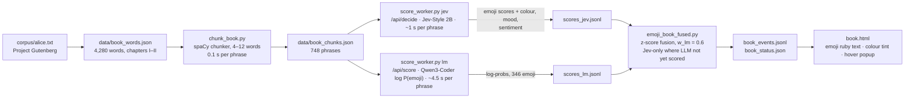
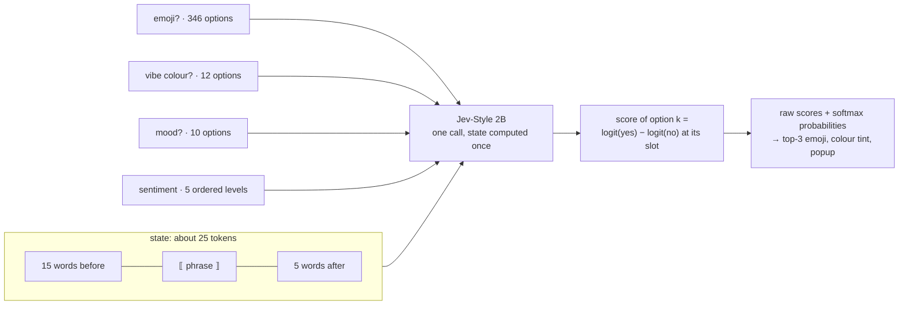

# Emoji book: Alice annotated phrase by phrase

Run from the repo root (paths below are relative to it); the gateway must be running. The page is served by [`pipelines/dashboard_server.py`](../dashboard_server.py).

Deterministic code around scorers: spaCy cuts the text into phrases, a decision model and an LLM score every emoji, the scores are fused, and the page renders them as ruby text above each phrase, tinted by the "vibe colour" when the model is confident.



What one decision-model call looks like (this is why attributes are nearly free: the state is computed once and every extra question only adds its own options):



The workers call the gateway (`pipelines/gateway_client.py`, stdlib only), so they run under any `python3` and never load a model; run them one at a time, since they share the GPU. The chunker and the fusion step need spaCy and numpy from `.venv-jev`.

```bash
.venv-jev/bin/python pipelines/emoji_book/chunk_book.py        # phrase boundaries -> data/book_chunks.json
python3 pipelines/emoji_book/score_worker.py jev               # resumable; --fresh to restart
python3 pipelines/emoji_book/score_worker.py lm                # optional: the gateway evicts idle backends to fit the 18 GB scorer
.venv-jev/bin/python pipelines/emoji_book/emoji_book_fused.py --fresh     # combine -> data/book_events.jsonl (follows the workers live)
python3 pipelines/dashboard_server.py &                        # http://127.0.0.1:8766/book
```

`recolor.py` re-answers only the colour question for phrases already scored, so prompt wording can be iterated quickly. Questions and the context window live in `jev_attrs.py`, the LLM's few-shot prompt in `lm_prompt.py`, the emoji list in `emoji_vocab.py`.
