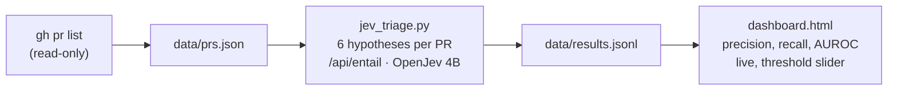

# PR triage: OpenJev on scala/scala

Run from the repo root; the gateway must be running. Read-only on GitHub (`gh pr list`).

Typed yes/no questions about each merged PR (title, changed files, start of the description; no diff), scored against the labels maintainers actually applied. 300 PRs, 1.24 s each, AUROC 0.80 to 0.99 but badly calibrated at the default threshold; see the findings log.



```bash
gh pr list -R scala/scala --state merged --limit 300 --json number,title,body,labels,files,mergedAt,author > data/prs.json
python3 pipelines/dashboard_server.py &                  # http://127.0.0.1:8766/
python3 pipelines/pr_triage/jev_triage.py --fresh
```
